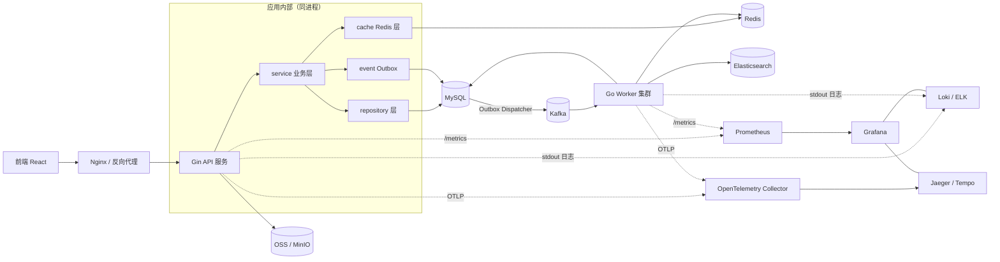

# 可观测性设计

面向 Feedora Go 后端（Gin + GORM + MySQL + Redis + Kafka + ES + OSS/MinIO）。目标是让任意一次请求或一条事件都可被“看见、度量、串联、告警”。

## 1. 可观测性四支柱

- **Logs（日志）**：发生了什么。见 `logging-spec.md`。
- **Metrics（指标）**：系统状态怎么样（QPS、延迟、错误率、Lag）。见 `metrics-design.md`。
- **Traces（链路）**：请求经过哪里、哪里慢。见 `tracing-design.md`。
- **Alerts（告警）**：什么时候需要人介入。见 `alerting-design.md`。

统一关联维度：`traceId`、`userId`、`module`、`action`、`bizId`。

## 2. 当前项目可观测性架构

## 3. 每一层采集什么

| 层 | Logs | Metrics | Traces |
|---|---|---|---|
| API（router/api） | 请求完成日志、慢请求 WARN | 请求数/耗时/状态码/错误数 | HTTP root span |
| Service | 关键业务动作、错误 | 业务计数（发帖/评论/点赞…） | Service span（接入 OTel 后） |
| Repository | 慢 SQL WARN | SQL 耗时、慢查询数、连接池 | DB span（GORM 插件） |
| Cache(Redis) | 慢命令 WARN、依赖异常 | 命中/未命中、命令耗时/错误 | Redis span |
| Event/Kafka | Outbox 投递、生产结果 | 生产成功/失败、Outbox pending/failed | Producer span |
| Worker | 消费成功/失败、幂等、重试 | 消费数/失败/重试/耗时、Lag | Consumer span |
| Search(ES) | 查询失败、慢查询 | 查询耗时/错误、写入耗时/错误 | ES span |
| OSS | 上传失败、慢上传 | 上传数/失败/耗时/大小 | OSS span |

## 4. 推荐技术栈

| 用途 | 选型 |
|---|---|
| 应用日志 | Zap（stdout JSON） |
| 指标采集 | Prometheus client_golang + `/metrics` |
| 可视化 | Grafana |
| 链路追踪 | OpenTelemetry SDK + OTLP |
| Trace 存储 | Jaeger 或 Grafana Tempo |
| 日志聚合 | Loki 或 ELK |
| Go 性能分析 | net/http/pprof |

## 5. 部署拓扑

- **Docker Compose 本地**：在现有 `deployments/docker-compose.yml` 追加 `prometheus`、`grafana`（可选 `loki`、`tempo/jaeger`）。API/Worker 暴露 `/metrics`，Prometheus 抓取宿主机 `host.docker.internal:8090/metrics`（API 本地运行）。
- **生产**：应用只写 stdout；Prometheus 以服务发现抓取；Grafana 接 Prometheus + Loki + Tempo；OTel Collector 统一接收 OTLP。
- **K8s 预留**：Pod 注解 `prometheus.io/scrape`；日志由 DaemonSet（promtail/filebeat）采集；Trace 通过 sidecar 或 Collector。

## 6. 数据关联方式

所有 Logs / Metrics（低基数 label）/ Traces 尽量携带 `traceId`、`userId`、`module`、`action`、`bizId`。约束：
- `traceId`、`userId` 不作为 Prometheus label（高基数），仅用于日志与 trace 关联；
- Grafana 中通过 `traceId` 在 Loki 日志与 Tempo trace 间跳转。

## 7. 排查问题推荐路径（示例：用户反馈发帖失败）

1. 拿到用户请求的 `X-Trace-Id`（响应头返回）。
2. Loki 按 `traceId` 检索：定位 API 请求日志，看 `statusCode`、`errorCode`。
3. 若 API 报错 → 看对应 Service/Repository 错误日志与慢 SQL。
4. 若 API 成功但内容未同步搜索 → 查 `event_outbox` 该 `traceId` 事件是否 `dispatched`。
5. 查 Worker 日志（同 `traceId`/`eventId`）是否消费成功、是否重试/失败。
6. 查 ES 索引是否写入（`search` worker 日志）。
7. 结合 Grafana 面板确认是否为整体性问题（错误率、延迟、Lag 突增）。
