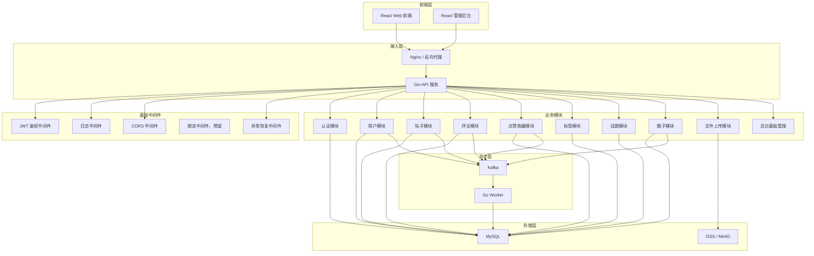

阶段一的目标不是一次性把 V2.1 所有能力都做满，而是先让前端项目能从 Mock 切到真实后端，跑通社区最核心闭环：

```text
注册登录 → 浏览内容 → 发布帖子 → 查看详情 → 评论互动 → 点赞收藏 → 圈子基础 → 标签话题 → 文件上传 → 后台基础管理
```

---

# 开发者知识社区 V2.1 后端 MVP 技术设计文档

## 1. 阶段一建设目标

## 1.1 MVP 目标

阶段一后端主要目标是支撑前端 V2.1 项目的真实接口接入。

核心目标：

```text
1. 提供稳定的 REST API。
2. 支撑前端从 VITE_API_MODE=mock 切换到 VITE_API_MODE=real。
3. 跑通社区核心业务链路。
4. 支持用户注册、登录、JWT 鉴权。
5. 支持帖子、评论、点赞、收藏、标签、话题、圈子基础能力。
6. 支持图片上传到 OSS。
7. 使用 Kafka 承接异步事件，为后续通知、搜索、积分、推荐扩展做准备。
8. 使用 GORM 管理 MySQL 数据访问。
9. 使用 Gin 提供 HTTP 服务。
10. 预留 Redis、ES、AI、工作空间、后台运营能力扩展点。
```

---

## 1.2 阶段一优先跑通的产品闭环

```text
用户注册登录
    ↓
完善个人资料
    ↓
浏览首页帖子流
    ↓
按标签 / 圈子 / 话题筛选内容
    ↓
发布帖子
    ↓
上传图片
    ↓
查看帖子详情
    ↓
评论 / 回复
    ↓
点赞 / 收藏
    ↓
加入圈子
    ↓
在圈子中发帖
    ↓
收到基础通知，后续扩展
```

---

# 2. 阶段一功能范围

## 2.1 本阶段实现模块

```text
1. 认证授权模块
2. 用户模块
3. 帖子模块
4. 评论模块
5. 互动模块
6. 标签模块
7. 话题模块
8. 圈子基础模块
9. 文件上传模块
10. Kafka 事件模块
11. 后台基础管理模块
12. 系统基础能力模块
```

---

## 2.2 本阶段暂不完整实现的能力

这些能力前端可以先保留页面，后端阶段一可以返回 Mock-like 空数据或基础占位数据：

```text
1. AI 问答
2. AI 模型配置
3. 圈子智能摘要
4. 工作空间笔记
5. 知识库协作
6. 个性化推荐
7. 复杂排行榜
8. 完整通知中心
9. 完整活动运营
10. 完整后台运营数据看板
11. Elasticsearch 全文搜索
12. WebSocket 圈子聊天
```

但是阶段一需要为这些能力预留：

```text
1. 数据库表扩展空间
2. API 路由结构
3. Kafka 事件结构
4. 模块目录结构
5. 统一响应和错误码
```

---

# 3. 技术选型

## 3.1 后端核心技术栈

| 类型      | 技术                                | 说明                |
| ------- | --------------------------------- | ----------------- |
| 语言      | Go                                | 后端主语言             |
| HTTP 框架 | Gin                               | 路由、中间件、参数绑定       |
| ORM     | GORM                              | MySQL 数据访问        |
| 数据库     | MySQL 8.x                         | 核心业务数据            |
| 消息队列    | Kafka                             | 异步事件、后续通知、搜索索引、积分 |
| 文件存储    | OSS / MinIO                       | 图片、头像、帖子图片        |
| 配置管理    | Viper                             | 读取 yaml/env       |
| 日志      | Zap                               | 结构化日志             |
| 鉴权      | JWT                               | 前后端分离认证           |
| 参数校验    | validator                         | 请求参数校验            |
| API 文档  | Swaggo                            | Swagger 文档        |
| 部署      | Docker Compose                    | 本地和服务器部署          |
| 迁移      | golang-migrate / GORM AutoMigrate | 数据库初始化            |

---

## 3.2 阶段一中间件建议

阶段一建议先启动：

```text
MySQL
Redis，可选但建议预留
Kafka
MinIO，作为本地 OSS
```

虽然你这次明确指定 Gin、GORM、Kafka、OSS，但我建议阶段一仍然把 Redis 接入位预留出来。
原因是后面点赞数、收藏数、排行榜、签到、热门榜单都很依赖 Redis。如果第一版暂时不想引入 Redis，也可以先用 MySQL 跑通，第二阶段再加缓存。

---

# 4. 后端整体架构

## 4.1 阶段一采用模块化单体

阶段一不要直接拆微服务。

推荐采用：

```text
一个 Go API 服务
一个 Go Worker 服务
一个 MySQL
一个 Kafka
一个 OSS / MinIO
```

也就是：

```text
API 服务负责同步请求
Worker 服务负责消费 Kafka 异步事件
```

---

## 4.2 架构框图



---

# 5. 项目目录设计

## 5.1 推荐目录结构

```text
community-backend
├── cmd
│   ├── api
│   │   └── main.go
│   └── worker
│       └── main.go
│
├── configs
│   ├── config.yaml
│   └── config.local.yaml
│
├── internal
│   ├── auth
│   │   ├── handler.go
│   │   ├── service.go
│   │   ├── repository.go
│   │   ├── model.go
│   │   ├── dto.go
│   │   └── router.go
│   │
│   ├── user
│   ├── post
│   ├── comment
│   ├── interaction
│   ├── tag
│   ├── topic
│   ├── circle
│   ├── file
│   ├── admin
│   └── event
│
├── pkg
│   ├── config
│   ├── database
│   ├── response
│   ├── errors
│   ├── logger
│   ├── middleware
│   ├── jwt
│   ├── kafka
│   ├── oss
│   ├── validator
│   └── utils
│
├── migrations
│   ├── 001_init_users.sql
│   ├── 002_init_posts.sql
│   ├── 003_init_comments.sql
│   ├── 004_init_circles.sql
│   └── 005_init_admin.sql
│
├── docs
│   ├── api.md
│   ├── database.md
│   ├── kafka.md
│   └── deploy.md
│
├── deployments
│   ├── docker-compose.yml
│   ├── Dockerfile.api
│   ├── Dockerfile.worker
│   └── nginx.conf
│
├── go.mod
└── README.md
```

---

## 5.2 模块内部结构说明

每个业务模块尽量统一结构：

```text
handler.go      HTTP 入口，解析参数，返回响应
service.go      业务逻辑，事务编排，权限校验
repository.go   数据库访问
model.go        GORM 模型
dto.go          请求体、响应体
router.go       路由注册
```

例如 `post` 模块：

```text
internal/post
├── handler.go
├── service.go
├── repository.go
├── model.go
├── dto.go
└── router.go
```

调用链：

```text
Router → Handler → Service → Repository → MySQL
                         ↓
                       Kafka
```

---

# 6. 分层设计

## 6.1 Handler 层

职责：

```text
1. 绑定请求参数
2. 参数校验
3. 从 Context 中获取 userId
4. 调用 Service
5. 统一返回 ApiResponse
```

不要在 Handler 里写复杂业务逻辑。

---

## 6.2 Service 层

职责：

```text
1. 核心业务规则
2. 权限校验
3. 事务控制
4. 多 Repository 编排
5. Kafka 事件发送
6. OSS 文件业务处理
```

例如发布帖子：

```text
校验用户状态
校验标题和正文
校验标签是否存在
校验圈子权限
开启事务
保存帖子
保存标签关系
保存话题关系
提交事务
发送 PostCreated 事件
返回结果
```

---

## 6.3 Repository 层

职责：

```text
1. 封装 GORM 查询
2. 不写复杂业务规则
3. 不直接操作 Gin Context
4. 提供明确的数据访问方法
```

---

## 6.4 Event 层

职责：

```text
1. 定义领域事件结构
2. 统一发送 Kafka 消息
3. Worker 消费事件
```

阶段一 Kafka 先重点用于：

```text
帖子创建事件
评论创建事件
点赞事件
收藏事件
用户注册事件
圈子加入事件
```

---

# 7. 统一响应格式

前端项目已经约定了统一响应结构，后端必须保持一致。

## 7.1 成功响应

```json
{
  "code": 0,
  "message": "success",
  "data": {},
  "traceId": "trace-xxx",
  "timestamp": "2026-07-06T10:00:00+08:00"
}
```

---

## 7.2 分页响应

```json
{
  "code": 0,
  "message": "success",
  "data": {
    "list": [],
    "total": 0,
    "page": 1,
    "pageSize": 10
  },
  "traceId": "trace-xxx",
  "timestamp": "2026-07-06T10:00:00+08:00"
}
```

---

## 7.3 错误响应

```json
{
  "code": 400,
  "message": "请求参数错误",
  "data": null,
  "traceId": "trace-xxx",
  "timestamp": "2026-07-06T10:00:00+08:00"
}
```

---

## 7.4 错误码设计

| code | 含义            |
| ---: | ------------- |
|    0 | 成功            |
|  400 | 请求参数错误        |
|  401 | 未登录或 token 过期 |
|  403 | 无权限           |
|  404 | 资源不存在         |
|  409 | 资源冲突          |
|  422 | 业务校验失败        |
|  429 | 请求过于频繁        |
|  500 | 服务内部错误        |

业务错误码：

|  code | 含义       |
| ----: | -------- |
| 10001 | 账号或密码错误  |
| 10002 | 账号已存在    |
| 10003 | 用户已被封禁   |
| 20001 | 帖子不存在    |
| 20002 | 帖子不可见    |
| 20003 | 无权操作该帖子  |
| 30001 | 评论不存在    |
| 40001 | 圈子不存在    |
| 40002 | 你已被该圈子禁言 |
| 40003 | 未加入圈子    |
| 50001 | 文件上传失败   |

---

# 8. 配置设计

## 8.1 config.yaml

```yaml
server:
  name: community-api
  env: local
  port: 8080
  readTimeout: 10s
  writeTimeout: 10s

mysql:
  dsn: root:123456@tcp(localhost:3306)/community?charset=utf8mb4&parseTime=True&loc=Local
  maxOpenConns: 50
  maxIdleConns: 10
  connMaxLifetime: 3600s

jwt:
  secret: community-secret
  expireHours: 168

kafka:
  brokers:
    - localhost:9092
  topicPrefix: community

oss:
  type: minio
  endpoint: localhost:9000
  accessKey: minioadmin
  secretKey: minioadmin
  bucket: community
  publicUrl: http://localhost:9000/community
  useSSL: false

cors:
  allowOrigins:
    - http://localhost:5173
```

---

# 9. 数据库设计

## 9.1 用户表 users

```sql
CREATE TABLE users (
    id BIGINT PRIMARY KEY AUTO_INCREMENT,
    account VARCHAR(64) NOT NULL,
    password_hash VARCHAR(255) NOT NULL,
    nickname VARCHAR(64) NOT NULL,
    avatar VARCHAR(512) DEFAULT '',
    bio VARCHAR(500) DEFAULT '',
    role VARCHAR(32) NOT NULL DEFAULT 'user',
    status VARCHAR(32) NOT NULL DEFAULT 'normal',
    follower_count BIGINT NOT NULL DEFAULT 0,
    following_count BIGINT NOT NULL DEFAULT 0,
    post_count BIGINT NOT NULL DEFAULT 0,
    like_count BIGINT NOT NULL DEFAULT 0,
    point_count BIGINT NOT NULL DEFAULT 0,
    level INT NOT NULL DEFAULT 1,
    created_at DATETIME NOT NULL,
    updated_at DATETIME NOT NULL,
    deleted_at DATETIME NULL,
    UNIQUE KEY uk_account (account),
    KEY idx_status (status),
    KEY idx_created_at (created_at)
) ENGINE=InnoDB DEFAULT CHARSET=utf8mb4;
```

---

## 9.2 帖子表 posts

```sql
CREATE TABLE posts (
    id BIGINT PRIMARY KEY AUTO_INCREMENT,
    author_id BIGINT NOT NULL,
    title VARCHAR(200) NOT NULL,
    content_md LONGTEXT NOT NULL,
    summary VARCHAR(500) DEFAULT '',
    post_type VARCHAR(32) NOT NULL DEFAULT 'original',
    source_post_id BIGINT NULL,
    circle_id BIGINT NULL,
    visibility VARCHAR(32) NOT NULL DEFAULT 'public',
    status VARCHAR(32) NOT NULL DEFAULT 'published',
    cover_url VARCHAR(512) DEFAULT '',
    view_count BIGINT NOT NULL DEFAULT 0,
    like_count BIGINT NOT NULL DEFAULT 0,
    comment_count BIGINT NOT NULL DEFAULT 0,
    favorite_count BIGINT NOT NULL DEFAULT 0,
    share_count BIGINT NOT NULL DEFAULT 0,
    repost_count BIGINT NOT NULL DEFAULT 0,
    hot_score BIGINT NOT NULL DEFAULT 0,
    scheduled_at DATETIME NULL,
    published_at DATETIME NULL,
    created_at DATETIME NOT NULL,
    updated_at DATETIME NOT NULL,
    deleted_at DATETIME NULL,
    KEY idx_author_status (author_id, status),
    KEY idx_circle_status (circle_id, status),
    KEY idx_status_created (status, created_at),
    KEY idx_hot_score (hot_score)
) ENGINE=InnoDB DEFAULT CHARSET=utf8mb4;
```

状态：

```text
draft       草稿
scheduled   定时发布
reviewing   审核中
published   已发布
hidden      已隐藏
rejected    审核拒绝
deleted     已删除
takedown    已下架
```

---

## 9.3 帖子图片表 post_images

```sql
CREATE TABLE post_images (
    id BIGINT PRIMARY KEY AUTO_INCREMENT,
    post_id BIGINT NOT NULL,
    image_url VARCHAR(512) NOT NULL,
    sort_order INT NOT NULL DEFAULT 0,
    created_at DATETIME NOT NULL,
    KEY idx_post_id (post_id)
) ENGINE=InnoDB DEFAULT CHARSET=utf8mb4;
```

---

## 9.4 标签表 tags

```sql
CREATE TABLE tags (
    id BIGINT PRIMARY KEY AUTO_INCREMENT,
    name VARCHAR(64) NOT NULL,
    description VARCHAR(255) DEFAULT '',
    status VARCHAR(32) NOT NULL DEFAULT 'enabled',
    use_count BIGINT NOT NULL DEFAULT 0,
    created_at DATETIME NOT NULL,
    updated_at DATETIME NOT NULL,
    UNIQUE KEY uk_name (name),
    KEY idx_status (status)
) ENGINE=InnoDB DEFAULT CHARSET=utf8mb4;
```

---

## 9.5 帖子标签关系 post_tags

```sql
CREATE TABLE post_tags (
    id BIGINT PRIMARY KEY AUTO_INCREMENT,
    post_id BIGINT NOT NULL,
    tag_id BIGINT NOT NULL,
    created_at DATETIME NOT NULL,
    UNIQUE KEY uk_post_tag (post_id, tag_id),
    KEY idx_tag_id (tag_id)
) ENGINE=InnoDB DEFAULT CHARSET=utf8mb4;
```

---

## 9.6 话题表 topics

```sql
CREATE TABLE topics (
    id BIGINT PRIMARY KEY AUTO_INCREMENT,
    name VARCHAR(128) NOT NULL,
    description VARCHAR(500) DEFAULT '',
    cover_url VARCHAR(512) DEFAULT '',
    is_official TINYINT NOT NULL DEFAULT 0,
    is_recommended TINYINT NOT NULL DEFAULT 0,
    participant_count BIGINT NOT NULL DEFAULT 0,
    post_count BIGINT NOT NULL DEFAULT 0,
    status VARCHAR(32) NOT NULL DEFAULT 'enabled',
    created_at DATETIME NOT NULL,
    updated_at DATETIME NOT NULL,
    UNIQUE KEY uk_name (name),
    KEY idx_status (status),
    KEY idx_recommended (is_recommended)
) ENGINE=InnoDB DEFAULT CHARSET=utf8mb4;
```

---

## 9.7 帖子话题关系 post_topics

```sql
CREATE TABLE post_topics (
    id BIGINT PRIMARY KEY AUTO_INCREMENT,
    post_id BIGINT NOT NULL,
    topic_id BIGINT NOT NULL,
    created_at DATETIME NOT NULL,
    UNIQUE KEY uk_post_topic (post_id, topic_id),
    KEY idx_topic_id (topic_id)
) ENGINE=InnoDB DEFAULT CHARSET=utf8mb4;
```

---

## 9.8 评论表 comments

```sql
CREATE TABLE comments (
    id BIGINT PRIMARY KEY AUTO_INCREMENT,
    post_id BIGINT NOT NULL,
    user_id BIGINT NOT NULL,
    parent_id BIGINT NOT NULL DEFAULT 0,
    root_id BIGINT NOT NULL DEFAULT 0,
    reply_to_user_id BIGINT NULL,
    content VARCHAR(2000) NOT NULL,
    status VARCHAR(32) NOT NULL DEFAULT 'normal',
    like_count BIGINT NOT NULL DEFAULT 0,
    created_at DATETIME NOT NULL,
    updated_at DATETIME NOT NULL,
    deleted_at DATETIME NULL,
    KEY idx_post_parent (post_id, parent_id),
    KEY idx_post_created (post_id, created_at),
    KEY idx_user_created (user_id, created_at),
    KEY idx_root_id (root_id)
) ENGINE=InnoDB DEFAULT CHARSET=utf8mb4;
```

---

## 9.9 点赞收藏表

### post_likes

```sql
CREATE TABLE post_likes (
    id BIGINT PRIMARY KEY AUTO_INCREMENT,
    post_id BIGINT NOT NULL,
    user_id BIGINT NOT NULL,
    created_at DATETIME NOT NULL,
    UNIQUE KEY uk_post_user (post_id, user_id),
    KEY idx_user_id (user_id)
) ENGINE=InnoDB DEFAULT CHARSET=utf8mb4;
```

### post_favorites

```sql
CREATE TABLE post_favorites (
    id BIGINT PRIMARY KEY AUTO_INCREMENT,
    post_id BIGINT NOT NULL,
    user_id BIGINT NOT NULL,
    created_at DATETIME NOT NULL,
    UNIQUE KEY uk_post_user (post_id, user_id),
    KEY idx_user_id (user_id)
) ENGINE=InnoDB DEFAULT CHARSET=utf8mb4;
```

### comment_likes

```sql
CREATE TABLE comment_likes (
    id BIGINT PRIMARY KEY AUTO_INCREMENT,
    comment_id BIGINT NOT NULL,
    user_id BIGINT NOT NULL,
    created_at DATETIME NOT NULL,
    UNIQUE KEY uk_comment_user (comment_id, user_id),
    KEY idx_user_id (user_id)
) ENGINE=InnoDB DEFAULT CHARSET=utf8mb4;
```

---

## 9.10 圈子表 circles

```sql
CREATE TABLE circles (
    id BIGINT PRIMARY KEY AUTO_INCREMENT,
    owner_id BIGINT NOT NULL,
    name VARCHAR(128) NOT NULL,
    avatar VARCHAR(512) DEFAULT '',
    description VARCHAR(500) DEFAULT '',
    category VARCHAR(64) DEFAULT '',
    join_type VARCHAR(32) NOT NULL DEFAULT 'direct',
    post_permission VARCHAR(32) NOT NULL DEFAULT 'all',
    rules TEXT NULL,
    status VARCHAR(32) NOT NULL DEFAULT 'normal',
    member_count BIGINT NOT NULL DEFAULT 0,
    post_count BIGINT NOT NULL DEFAULT 0,
    featured_count BIGINT NOT NULL DEFAULT 0,
    is_recommended TINYINT NOT NULL DEFAULT 0,
    created_at DATETIME NOT NULL,
    updated_at DATETIME NOT NULL,
    deleted_at DATETIME NULL,
    UNIQUE KEY uk_name (name),
    KEY idx_owner_id (owner_id),
    KEY idx_status (status),
    KEY idx_recommended (is_recommended)
) ENGINE=InnoDB DEFAULT CHARSET=utf8mb4;
```

---

## 9.11 圈子成员表 circle_members

```sql
CREATE TABLE circle_members (
    id BIGINT PRIMARY KEY AUTO_INCREMENT,
    circle_id BIGINT NOT NULL,
    user_id BIGINT NOT NULL,
    role VARCHAR(32) NOT NULL DEFAULT 'member',
    status VARCHAR(32) NOT NULL DEFAULT 'normal',
    mute_reason VARCHAR(255) DEFAULT '',
    muted_until DATETIME NULL,
    joined_at DATETIME NOT NULL,
    updated_at DATETIME NOT NULL,
    UNIQUE KEY uk_circle_user (circle_id, user_id),
    KEY idx_user_id (user_id),
    KEY idx_circle_role (circle_id, role),
    KEY idx_circle_status (circle_id, status)
) ENGINE=InnoDB DEFAULT CHARSET=utf8mb4;
```

角色：

```text
owner
moderator
reviewer
member
```

状态：

```text
normal
muted
removed
```

---

## 9.12 文件表 files

```sql
CREATE TABLE files (
    id BIGINT PRIMARY KEY AUTO_INCREMENT,
    user_id BIGINT NOT NULL,
    biz_type VARCHAR(64) NOT NULL,
    filename VARCHAR(255) NOT NULL,
    object_key VARCHAR(512) NOT NULL,
    url VARCHAR(512) NOT NULL,
    size BIGINT NOT NULL DEFAULT 0,
    mime_type VARCHAR(128) NOT NULL,
    created_at DATETIME NOT NULL,
    KEY idx_user_id (user_id),
    KEY idx_biz_type (biz_type)
) ENGINE=InnoDB DEFAULT CHARSET=utf8mb4;
```

---

# 10. 核心模块设计

## 10.1 认证授权模块

### 功能

```text
注册
登录
获取当前用户
退出登录
JWT 鉴权
```

### 接口

```text
POST /api/v1/auth/register
POST /api/v1/auth/login
POST /api/v1/auth/logout
GET  /api/v1/auth/me
```

### 注册请求

```json
{
  "account": "zhangsan",
  "nickname": "张三",
  "password": "123456"
}
```

### 登录响应

```json
{
  "code": 0,
  "message": "success",
  "data": {
    "token": "jwt-token",
    "user": {
      "userId": 1,
      "nickname": "张三",
      "avatar": "",
      "role": "user"
    }
  }
}
```

### 实现要点

```text
1. 密码使用 bcrypt 加密。
2. JWT 中保存 userId、role、过期时间。
3. 登录成功返回 token 和用户信息。
4. 前端请求时使用 Authorization: Bearer <token>。
5. 被封禁用户不能登录。
```

---

## 10.2 用户模块

### 功能

```text
查看我的资料
编辑我的资料
查看用户主页
查看我的帖子
查看我的评论
查看我的点赞
查看我的收藏
```

### 接口

```text
GET  /api/v1/users/me
PUT  /api/v1/users/me/profile
GET  /api/v1/users/:userId
GET  /api/v1/users/me/posts
GET  /api/v1/users/me/comments
GET  /api/v1/users/me/liked-posts
GET  /api/v1/users/me/favorite-posts
```

### 实现要点

```text
1. 我的资料从 JWT userId 获取。
2. 其他用户主页只展示公开信息。
3. 我的帖子可以看到 hidden 状态。
4. 其他用户不能看到 hidden 帖子。
```

---

## 10.3 帖子模块

### 功能

```text
首页帖子列表
帖子详情
发布帖子
编辑帖子
删除帖子
隐藏帖子
取消隐藏
定时发布，阶段一可先保存状态
转发，阶段一可先做基础版本
分享计数
```

### 接口

```text
GET    /api/v1/posts
GET    /api/v1/posts/:postId
POST   /api/v1/posts
PUT    /api/v1/posts/:postId
DELETE /api/v1/posts/:postId
PUT    /api/v1/posts/:postId/hide
PUT    /api/v1/posts/:postId/unhide
POST   /api/v1/posts/:postId/share
POST   /api/v1/posts/:postId/repost
```

### 帖子列表 Query

```text
page
pageSize
feedType
timeRange
tagId
circleId
topicId
keyword
sort
```

### 发布帖子请求

```json
{
  "title": "Go 项目部署复盘",
  "content": "# Go 项目部署复盘\n\n这里是正文",
  "images": ["https://oss.example.com/a.png"],
  "tagIds": [1, 2],
  "topicIds": [1],
  "circleId": 1,
  "visibility": "public",
  "publishMode": "now",
  "scheduledAt": null
}
```

### 实现要点

```text
1. content 字段保存 Markdown 原文。
2. 创建帖子时保存 posts、post_images、post_tags、post_topics。
3. 如果 circleId 不为空，需要校验用户是否有发帖权限。
4. visibility 支持 public / circle_only。
5. hidden 帖子只允许作者自己查看。
6. 删除使用软删除。
7. 发布成功后发送 Kafka PostCreated 事件。
```

---

## 10.4 评论模块

### 功能

```text
获取帖子评论
发表评论
回复评论
删除评论
评论点赞
```

### 接口

```text
GET    /api/v1/posts/:postId/comments
POST   /api/v1/comments
POST   /api/v1/comments/:commentId/replies
DELETE /api/v1/comments/:commentId
POST   /api/v1/comments/:commentId/like
DELETE /api/v1/comments/:commentId/like
```

### 创建评论请求

```json
{
  "postId": 1,
  "content": "这篇文章很有帮助"
}
```

### 回复评论请求

```json
{
  "content": "我也这么觉得",
  "replyToUserId": 2
}
```

### 实现要点

```text
1. 评论只允许登录用户发布。
2. 用户被禁言时不能评论。
3. 帖子不存在或不可见时不能评论。
4. 评论后 posts.comment_count + 1。
5. 评论成功发送 Kafka CommentCreated 事件。
6. 删除评论使用软删除或状态 deleted。
```

---

## 10.5 互动模块

### 功能

```text
点赞帖子
取消点赞
收藏帖子
取消收藏
点赞评论
取消点赞评论
```

### 接口

```text
POST   /api/v1/posts/:postId/like
DELETE /api/v1/posts/:postId/like
POST   /api/v1/posts/:postId/favorite
DELETE /api/v1/posts/:postId/favorite
POST   /api/v1/comments/:commentId/like
DELETE /api/v1/comments/:commentId/like
```

### 实现要点

```text
1. 使用唯一索引保证幂等。
2. 已点赞再次点赞，不重复加数。
3. 点赞后更新帖子 like_count。
4. 收藏后更新帖子 favorite_count。
5. 发送 Kafka 互动事件。
```

阶段一可以先直接写 MySQL，第二阶段再改成 Redis 计数 + Kafka 异步落库。

---

## 10.6 标签模块

### 功能

```text
标签列表
标签详情
标签下帖子
```

### 接口

```text
GET /api/v1/tags
GET /api/v1/tags/:tagId
GET /api/v1/tags/:tagId/posts
```

### 实现要点

```text
1. 发布帖子时校验标签是否存在。
2. 标签禁用后不能被新帖子使用。
3. 标签 use_count 可在发帖时同步增加。
```

---

## 10.7 话题模块

### 功能

```text
话题广场
话题详情
话题下帖子
官方话题
热门话题
最新话题
```

### 接口

```text
GET /api/v1/topics
GET /api/v1/topics/:topicId
GET /api/v1/topics/:topicId/posts
```

### 话题列表 Query

```text
tab=all|official|hot|latest
page=1
pageSize=20
```

### 实现要点

```text
1. 话题支持封面图。
2. 官方话题 is_official = true。
3. 热门话题可按 participant_count 或 post_count 排序。
4. 参与话题本质是发帖时绑定 topicId。
```

---

## 10.8 圈子模块

### 功能

```text
圈子列表
圈子详情
创建圈子
加入圈子
退出圈子
我加入的圈子
我创建的圈子
圈子帖子
圈子成员
成员禁言
解除禁言
```

### 接口

```text
GET    /api/v1/circles
POST   /api/v1/circles
GET    /api/v1/circles/:circleId
POST   /api/v1/circles/:circleId/join
POST   /api/v1/circles/:circleId/leave
GET    /api/v1/circles/:circleId/posts
GET    /api/v1/circles/:circleId/members
PUT    /api/v1/circles/:circleId/members/:userId/mute
PUT    /api/v1/circles/:circleId/members/:userId/unmute
DELETE /api/v1/circles/:circleId/members/:userId
```

### 圈子列表 Query

```text
scope=all|recommended|joined|created
keyword
category
tagId
sort
page
pageSize
```

### 创建圈子请求

```json
{
  "name": "Go 后端开发圈",
  "avatar": "https://oss.example.com/circle.png",
  "description": "专注 Go、微服务、性能优化和工程实践",
  "category": "后端开发",
  "joinType": "direct",
  "postPermission": "all",
  "rules": "请遵守圈子规则"
}
```

### 禁言请求

```json
{
  "durationType": "days",
  "durationValue": 7,
  "reason": "刷屏"
}
```

### 实现要点

```text
1. 创建圈子后，创建者自动成为 owner。
2. joinType=direct 时直接加入。
3. 阶段一 approval 可先返回申请已提交，审批后续实现。
4. 成员被 muted 后不能在圈子发帖。
5. 圈子发帖时必须检查成员状态和发帖权限。
```

---

## 10.9 文件上传模块

### 功能

```text
上传头像
上传帖子图片
上传圈子头像
上传话题封面
```

### 接口

```text
POST /api/v1/files/upload
```

### 请求

```text
Content-Type: multipart/form-data

file: File
bizType: avatar | post_image | circle_avatar | topic_cover | activity_cover
```

### 响应

```json
{
  "code": 0,
  "message": "success",
  "data": {
    "url": "http://localhost:9000/community/post/xxx.png",
    "filename": "xxx.png",
    "size": 123456,
    "mimeType": "image/png"
  }
}
```

### 实现要点

```text
1. 阶段一使用 MinIO 模拟 OSS。
2. 文件路径按 bizType 和日期分目录。
3. 限制文件大小，例如 5MB。
4. 限制 mimeType，只允许图片。
5. 上传成功后写 files 表。
```

---

## 10.10 后台基础管理模块

阶段一后台只需要支持基础查询和操作，保证前端后台页面能接入真实接口。

### 功能

```text
用户列表
帖子列表
评论列表
标签管理
话题管理
圈子管理
举报列表，阶段一可占位
审核列表，阶段一可占位
```

### 接口

```text
GET /api/v1/admin/users
GET /api/v1/admin/posts
GET /api/v1/admin/comments
GET /api/v1/admin/tags
POST /api/v1/admin/tags
PUT /api/v1/admin/tags/:tagId
GET /api/v1/admin/topics
POST /api/v1/admin/topics
PUT /api/v1/admin/topics/:topicId
GET /api/v1/admin/circles
```

### 实现要点

```text
1. 只有 role=admin 的用户可以访问。
2. 所有后台写操作记录操作日志，阶段一可以先建 operation_logs 表。
3. 后台操作不要影响前台路由。
```

---

# 11. Kafka 事件设计

## 11.1 Topic 设计

阶段一建议先用少量 Topic：

```text
community.user.events
community.post.events
community.comment.events
community.interaction.events
community.circle.events
```

---

## 11.2 事件结构

统一事件结构：

```go
type Event struct {
    EventID   string      `json:"eventId"`
    EventType string      `json:"eventType"`
    BizID     int64       `json:"bizId"`
    UserID    int64       `json:"userId"`
    Payload   interface{} `json:"payload"`
    CreatedAt time.Time   `json:"createdAt"`
}
```

---

## 11.3 事件类型

```text
UserRegistered
PostCreated
PostUpdated
PostDeleted
PostHidden
CommentCreated
PostLiked
PostUnliked
PostFavorited
PostUnfavorited
CircleCreated
CircleJoined
CircleMemberMuted
```

---

## 11.4 阶段一 Worker 职责

阶段一 Worker 可以先做轻量处理：

```text
1. 打印消费日志。
2. 预留通知生成逻辑。
3. 预留积分发放逻辑。
4. 预留搜索索引同步逻辑。
```

后续阶段再真正实现：

```text
1. 写通知表
2. 写积分流水
3. 写 ES 索引
4. 更新排行榜
```

---

# 12. API 路由总览

## 12.1 Public API

```text
POST /api/v1/auth/register
POST /api/v1/auth/login
GET  /api/v1/posts
GET  /api/v1/posts/:postId
GET  /api/v1/tags
GET  /api/v1/topics
GET  /api/v1/circles
```

---

## 12.2 Auth API

```text
GET    /api/v1/auth/me
POST   /api/v1/auth/logout

PUT    /api/v1/users/me/profile
GET    /api/v1/users/me/posts
GET    /api/v1/users/me/comments
GET    /api/v1/users/me/liked-posts
GET    /api/v1/users/me/favorite-posts

POST   /api/v1/posts
PUT    /api/v1/posts/:postId
DELETE /api/v1/posts/:postId
PUT    /api/v1/posts/:postId/hide
PUT    /api/v1/posts/:postId/unhide

POST   /api/v1/comments
POST   /api/v1/comments/:commentId/replies
DELETE /api/v1/comments/:commentId

POST   /api/v1/posts/:postId/like
DELETE /api/v1/posts/:postId/like
POST   /api/v1/posts/:postId/favorite
DELETE /api/v1/posts/:postId/favorite

POST   /api/v1/circles
POST   /api/v1/circles/:circleId/join
POST   /api/v1/circles/:circleId/leave

POST   /api/v1/files/upload
```

---

## 12.3 Admin API

```text
GET /api/v1/admin/users
GET /api/v1/admin/posts
GET /api/v1/admin/comments
GET /api/v1/admin/tags
GET /api/v1/admin/topics
GET /api/v1/admin/circles
```

---

# 13. 鉴权与权限设计

## 13.1 JWT Payload

```json
{
  "userId": 1,
  "role": "user",
  "exp": 1780000000
}
```

---

## 13.2 中间件

```text
AuthMiddleware
AdminMiddleware
TraceMiddleware
LoggerMiddleware
CorsMiddleware
RecoverMiddleware
```

---

## 13.3 权限规则

| 场景     | 规则               |
| ------ | ---------------- |
| 发帖     | 必须登录，用户状态 normal |
| 评论     | 必须登录，用户状态 normal |
| 点赞收藏   | 必须登录             |
| 编辑帖子   | 只能作者本人           |
| 隐藏帖子   | 只能作者本人           |
| 删除帖子   | 作者本人或管理员         |
| 圈子发帖   | 必须是圈子成员且未被禁言     |
| 圈子成员禁言 | 圈主或管理员           |
| 后台接口   | role=admin       |

---

# 14. OSS 设计

## 14.1 文件路径设计

```text
/avatar/{userId}/{yyyyMMdd}/{uuid}.png
/post/{userId}/{yyyyMMdd}/{uuid}.png
/circle/{circleId}/{yyyyMMdd}/{uuid}.png
/topic/{yyyyMMdd}/{uuid}.png
```

---

## 14.2 OSS 接口抽象

定义统一接口：

```go
type Storage interface {
    Upload(ctx context.Context, objectKey string, reader io.Reader, size int64, contentType string) (string, error)
    Delete(ctx context.Context, objectKey string) error
}
```

阶段一实现：

```text
MinIOStorage
```

后续可切换：

```text
AliyunOSSStorage
TencentCOSStorage
S3Storage
```

---

# 15. GORM 模型规范

## 15.1 基础模型

```go
type BaseModel struct {
    ID        int64          `gorm:"primaryKey;column:id"`
    CreatedAt time.Time     `gorm:"column:created_at"`
    UpdatedAt time.Time     `gorm:"column:updated_at"`
    DeletedAt gorm.DeletedAt `gorm:"column:deleted_at;index"`
}
```

---

## 15.2 命名规范

```text
1. 表名使用复数蛇形：users、posts、post_likes。
2. 字段使用 snake_case。
3. Go struct 使用驼峰。
4. GORM tag 明确 column 名。
5. 所有时间使用 time.Time。
6. 金额、计数使用 int64。
```

---

# 16. 日志设计

使用 Zap 结构化日志。

日志字段建议：

```json
{
  "level": "info",
  "traceId": "trace-xxx",
  "userId": 1,
  "method": "POST",
  "path": "/api/v1/posts",
  "status": 200,
  "durationMs": 31,
  "message": "request completed"
}
```

代码里输出日志时，保持格式化习惯，例如：

```go
logger.Infof("create post success, postId:%d", postID)
```

---

# 17. 部署设计

## 17.1 Docker Compose 服务

```text
community-api
community-worker
mysql
kafka
zookeeper，或 kraft 模式
minio
nginx，可选
```

---

## 17.2 docker-compose.yml 结构示意

```yaml
services:
  mysql:
    image: mysql:8.0

  kafka:
    image: bitnami/kafka:latest

  minio:
    image: minio/minio

  community-api:
    build:
      context: .
      dockerfile: deployments/Dockerfile.api
    depends_on:
      - mysql
      - kafka
      - minio

  community-worker:
    build:
      context: .
      dockerfile: deployments/Dockerfile.worker
    depends_on:
      - kafka
      - mysql
```

---

# 18. 阶段一开发任务拆解

## 18.1 基础工程

```text
1. 初始化 Go 项目。
2. 接入 Gin。
3. 接入 GORM。
4. 接入 MySQL。
5. 接入 Zap 日志。
6. 接入 Viper 配置。
7. 实现统一响应。
8. 实现错误码。
9. 实现 JWT。
10. 实现 CORS。
```

---

## 18.2 业务模块

```text
1. 认证模块
2. 用户模块
3. 帖子模块
4. 评论模块
5. 点赞收藏模块
6. 标签模块
7. 话题模块
8. 圈子模块
9. 文件上传模块
10. 后台基础管理模块
```

---

## 18.3 异步与基础设施

```text
1. 接入 Kafka Producer。
2. 实现统一事件结构。
3. API 业务成功后发送事件。
4. 实现 Worker 消费事件。
5. 接入 MinIO。
6. 实现文件上传。
```

---

## 18.4 文档与联调

```text
1. Swagger 文档。
2. 数据库建表 SQL。
3. Postman / Apifox 接口集合。
4. 前端 Real API 联调说明。
5. Docker Compose 启动文档。
```

---

# 19. 阶段一验收标准

阶段一完成后，应满足：

```text
1. npm 前端设置 VITE_API_MODE=real 后可以接入后端。
2. 用户可以注册。
3. 用户可以登录。
4. 用户可以获取当前登录信息。
5. 用户可以发布帖子。
6. 首页可以展示真实帖子列表。
7. 帖子详情可以展示真实数据。
8. 用户可以评论帖子。
9. 用户可以点赞、收藏帖子。
10. 用户可以创建圈子。
11. 用户可以加入圈子。
12. 用户可以在圈子下发帖。
13. 用户可以上传图片到 OSS。
14. 管理员可以访问后台基础列表。
15. Kafka 能收到核心业务事件。
16. Worker 能正常消费事件。
17. 项目可以通过 Docker Compose 启动。
18. Swagger 文档可以访问。
```

---

# 20. 阶段一总结

阶段一后端 MVP 的核心不是把所有 V2.1 功能一次性做满，而是建立一个可靠的 Go 后端底座。

它要先解决：

```text
1. 前端真实接口接入
2. 用户认证
3. 内容发布
4. 内容浏览
5. 评论互动
6. 圈子基础
7. 文件上传
8. Kafka 异步事件
9. 后续搜索、通知、推荐、AI 的扩展基础
```

最终阶段一的技术形态是：

```text
Gin 提供 REST API
GORM 操作 MySQL
Kafka 承接异步事件
OSS / MinIO 管理图片文件
JWT 完成用户认证
Docker Compose 完成本地和服务器部署
```

一句话总结：

```text
阶段一先做一个可运行、可联调、可扩展的社区后端 MVP，
让前端从 Mock 真正切到 Real API，并为后续 Redis、ES、AI、通知、推荐和大规模用户场景打好基础。
```
