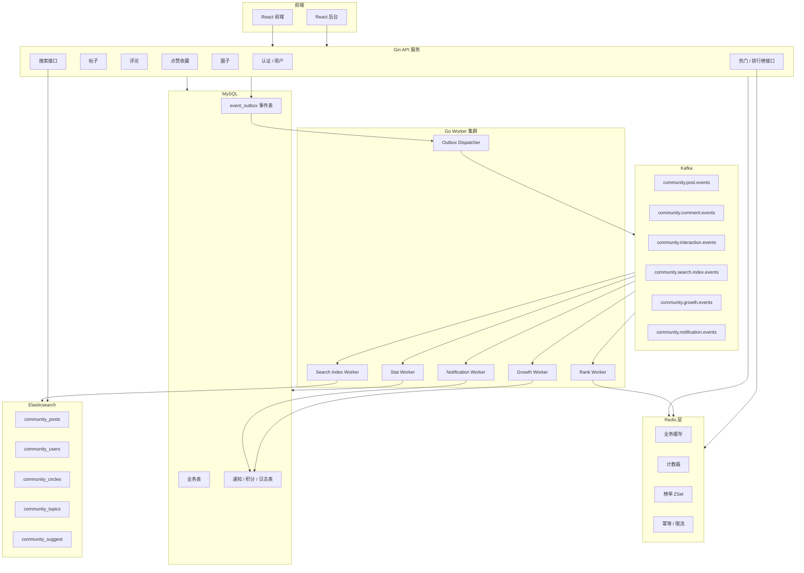
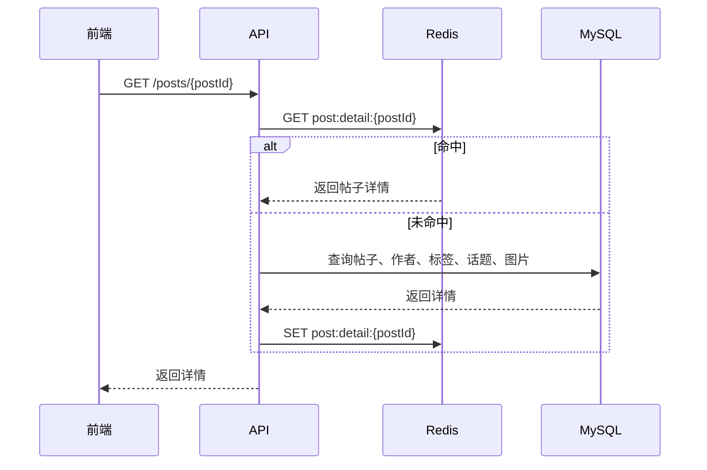
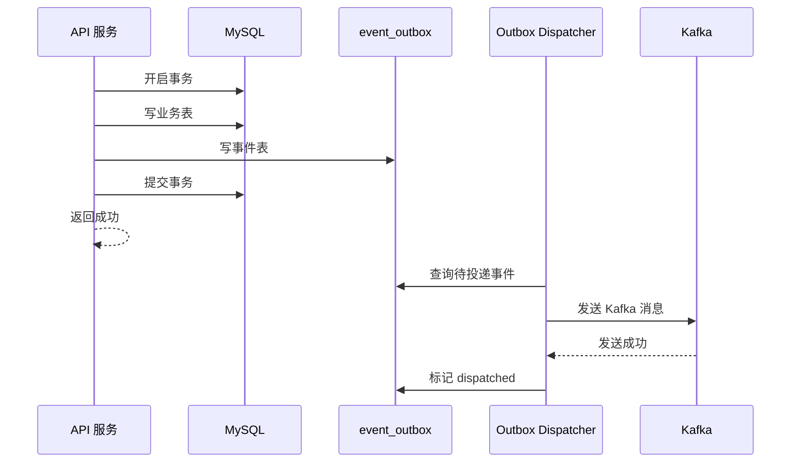
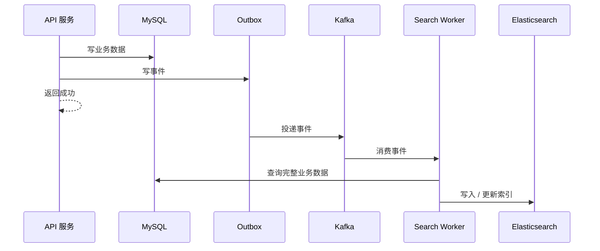

# 开发者知识社区 V2.1 阶段二技术设计文档

## Redis + Kafka Worker + Elasticsearch 搜索

## 1. 阶段二建设目标

阶段一已经完成了后端 MVP 闭环：

```text
注册登录
用户资料
帖子发布
帖子列表
帖子详情
评论
点赞收藏
标签
话题
圈子基础
文件上传
Kafka 事件骨架
后台基础管理
```

阶段二的目标是把阶段一从“能跑通业务闭环”升级为“能支撑较多用户访问的社区后端底座”。

阶段二重点建设三类能力：

```text
1. Redis：
   承接高频读、热点缓存、计数、排行榜、关注关系、限流、幂等。

2. Kafka Worker：
   把通知、积分、搜索索引、统计、榜单等非核心同步逻辑异步化。

3. Elasticsearch：
   支撑帖子、评论、用户、圈子、话题的全文搜索、搜索联想和聚合查询。
```

阶段二完成后，前端继续保持现有接口风格不变，但后端性能和扩展性会明显提升。

---

# 2. 阶段二功能范围

## 2.1 本阶段新增能力

```text
1. Redis 基础接入
2. Redis 缓存封装
3. 帖子详情缓存
4. 用户资料缓存
5. 圈子详情缓存
6. 首页内容流短缓存
7. 点赞 / 收藏计数缓存
8. 浏览数 / 分享数计数缓存
9. 热门榜单 Redis ZSet
10. 排行榜 Redis ZSet
11. Kafka Worker 真正消费业务事件
12. 通知异步生成
13. 积分异步发放
14. 搜索索引异步同步
15. ES 帖子搜索
16. ES 用户 / 圈子 / 话题搜索
17. 搜索联想
18. 热门搜索词统计
19. Outbox 事件表，保证业务数据与 Kafka 事件可靠投递
20. Worker 幂等消费机制
```

---

## 2.2 本阶段不做完整实现的能力

```text
1. AI 问答真实模型调用
2. 圈子智能摘要真实生成
3. 工作空间全文搜索
4. WebSocket 圈子聊天
5. 完整个性化推荐算法
6. 复杂审核流
7. 多级权限平台化
```

这些能力会依赖阶段二的 Redis、Kafka、ES 底座，适合放到阶段三继续做。

---

# 3. 阶段二整体架构



---

# 4. 技术选型

## 4.1 阶段二新增技术

| 类型           | 技术                          | 用途                |
| ------------ | --------------------------- | ----------------- |
| 缓存           | Redis                       | 业务缓存、计数、排行榜、幂等、限流 |
| Go Redis 客户端 | go-redis                    | Go 服务访问 Redis     |
| 消息队列         | Kafka                       | 异步事件总线            |
| Kafka Go 客户端 | segmentio/kafka-go 或 sarama | 生产、消费 Kafka 消息    |
| 搜索引擎         | Elasticsearch / OpenSearch  | 全文搜索、搜索联想、聚合      |
| ES Go 客户端    | elasticsearch-go            | 访问 ES             |
| 幂等存储         | Redis + MySQL               | Worker 消费幂等       |
| 事件可靠投递       | Outbox Pattern              | 防止业务成功但事件丢失       |

---

# 5. 阶段二项目目录调整

在阶段一项目基础上新增以下目录：

```text

```

---

# 6. Redis 设计

## 6.1 Redis 使用场景

阶段二 Redis 主要承接这些能力：

```text
1. 用户资料缓存
2. 帖子详情缓存
3. 圈子详情缓存
4. 首页内容流短缓存
5. 点赞 / 收藏 / 评论 / 分享计数
6. 用户是否点赞 / 收藏判断
7. 热门榜单
8. 排行榜
9. 热门搜索词
10. 限流
11. Worker 幂等
12. 缓存击穿保护
```

---

## 6.2 Redis Key 规范

统一格式：

```text
业务域:对象:标识:附加维度
```

示例：

```text
post:detail:10001
user:profile:20001
circle:detail:1
rank:post:today
```

---

## 6.3 Redis Key 设计

## 6.3.1 用户缓存

| Key                        | 类型          |   TTL | 说明                           |
| -------------------------- | ----------- | ----: | ---------------------------- |
| `user:profile:{userId}`    | String JSON | 30min | 用户基础资料                       |
| `user:followings:{userId}` | Set         | 30min | 用户关注的人                       |
| `user:followers:{userId}`  | Set         | 30min | 用户粉丝                         |
| `user:status:{userId}`     | String      | 10min | 用户状态，normal / muted / banned |

---

## 6.3.2 帖子缓存

| Key                         | 类型          |     TTL | 说明     |
| --------------------------- | ----------- | ------: | ------ |
| `post:detail:{postId}`      | String JSON |   10min | 帖子详情   |
| `post:counter:{postId}`     | Hash        | 无固定 TTL | 帖子计数   |
| `post:liked:{postId}`       | Set         |      7d | 点赞用户集合 |
| `post:favorited:{postId}`   | Set         |      7d | 收藏用户集合 |
| `user:liked_posts:{userId}` | Set         |      7d | 用户点赞帖子 |
| `user:favorites:{userId}`   | Set         |      7d | 用户收藏帖子 |

`post:counter:{postId}` Hash 字段：

```text
viewCount
likeCount
commentCount
favoriteCount
shareCount
repostCount
hotScore
```

---

## 6.3.3 首页内容流缓存

| Key                                  | 类型          | TTL | 说明      |
| ------------------------------------ | ----------- | --: | ------- |
| `feed:home:{queryHash}`              | String JSON | 60s | 首页列表短缓存 |
| `feed:circle:{circleId}:{queryHash}` | String JSON | 60s | 圈子内容流   |
| `feed:topic:{topicId}:{queryHash}`   | String JSON | 60s | 话题内容流   |
| `feed:tag:{tagId}:{queryHash}`       | String JSON | 60s | 标签内容流   |

说明：

```text
首页列表缓存 TTL 不要太长，避免内容更新延迟明显。
一般 30 秒到 2 分钟比较合适。
```

---

## 6.3.4 圈子缓存

| Key                                 | 类型          |   TTL | 说明             |
| ----------------------------------- | ----------- | ----: | -------------- |
| `circle:detail:{circleId}`          | String JSON | 15min | 圈子详情           |
| `circle:member:{circleId}:{userId}` | String JSON | 10min | 当前用户在圈子中的身份和状态 |
| `circle:joined:{userId}`            | Set         | 30min | 用户加入的圈子        |
| `circle:created:{userId}`           | Set         | 30min | 用户创建的圈子        |

---

## 6.3.5 热门榜单

| Key                 | 类型   | 说明     |
| ------------------- | ---- | ------ |
| `rank:post:today`   | ZSet | 今日热门帖子 |
| `rank:post:week`    | ZSet | 本周热门帖子 |
| `rank:post:all`     | ZSet | 总热门帖子  |
| `rank:circle:today` | ZSet | 今日热门圈子 |
| `rank:circle:week`  | ZSet | 本周热门圈子 |
| `rank:circle:all`   | ZSet | 总热门圈子  |
| `rank:topic:today`  | ZSet | 今日热门话题 |
| `rank:topic:week`   | ZSet | 本周热门话题 |
| `rank:topic:all`    | ZSet | 总热门话题  |

ZSet：

```text
member = 业务 ID
score  = 热度分
```

---

## 6.3.6 用户排行榜

| Key                      | 类型   | 说明     |
| ------------------------ | ---- | ------ |
| `rank:user:active:day`   | ZSet | 用户日活跃榜 |
| `rank:user:active:week`  | ZSet | 用户周活跃榜 |
| `rank:user:active:all`   | ZSet | 用户总活跃榜 |
| `rank:user:creator:day`  | ZSet | 创作者日榜  |
| `rank:user:creator:week` | ZSet | 创作者周榜  |
| `rank:user:creator:all`  | ZSet | 创作者总榜  |
| `rank:circle:member:all` | ZSet | 圈子榜    |

---

## 6.3.7 搜索相关

| Key                         | 类型          | 说明      |
| --------------------------- | ----------- | ------- |
| `search:hot_keywords`       | ZSet        | 热门搜索词   |
| `search:suggest:{keyword}`  | String JSON | 搜索联想短缓存 |
| `search:result:{queryHash}` | String JSON | 搜索结果短缓存 |

---

## 6.3.8 幂等与限流

| Key                        | 类型               |  TTL | 说明          |
| -------------------------- | ---------------- | ---: | ----------- |
| `idem:event:{eventId}`     | String           |  24h | Worker 消费幂等 |
| `rate:api:{userId}:{path}` | String / Counter | 1min | 用户接口限流      |
| `rate:ip:{ip}:{path}`      | String / Counter | 1min | IP 限流       |

---

# 7. Redis 缓存策略

## 7.1 Cache Aside 策略

读流程：

```text
先查 Redis
Redis 未命中查 MySQL
查到后写 Redis
返回数据
```

写流程：

```text
先写 MySQL
再删除 Redis
不直接更新 Redis
```

适用场景：

```text
用户资料
帖子详情
圈子详情
```

---

## 7.2 帖子详情缓存流程



---

## 7.3 点赞计数策略

阶段一点赞是直接写 MySQL。阶段二优化为：

```text
1. 点赞关系可以写 MySQL，也可以先写 Redis。
2. 点赞计数优先更新 Redis。
3. Kafka 事件异步同步统计数据。
4. 定时任务定期把 Redis 计数回写 MySQL。
```

阶段二建议采用折中方案：

```text
关系表仍然同步写 MySQL，保证数据可靠。
计数字段同步更新 Redis，同时异步刷新 MySQL。
```

这样复杂度可控，前端反馈也快。

---

# 8. Kafka 设计

## 8.1 阶段二 Kafka 目标

阶段一 Kafka 只是事件骨架。
阶段二要让 Kafka 真正承接异步业务：

```text
1. 通知生成
2. 积分发放
3. 搜索索引同步
4. 热门榜单更新
5. 统计数据更新
```

---

## 8.2 Topic 设计

| Topic                           | 说明                |
| ------------------------------- | ----------------- |
| `community.user.events`         | 用户注册、资料更新、关注等     |
| `community.post.events`         | 发帖、编辑、删除、隐藏、分享、转发 |
| `community.comment.events`      | 评论、回复、删除          |
| `community.interaction.events`  | 点赞、收藏、评论点赞        |
| `community.circle.events`       | 圈子创建、加入、成员管理      |
| `community.search.index.events` | 搜索索引同步事件          |
| `community.notification.events` | 通知事件              |
| `community.growth.events`       | 积分、任务、等级事件        |
| `community.rank.events`         | 热门榜单、排行榜事件        |
| `community.stat.events`         | 数据统计事件            |

---

## 8.3 事件结构

统一事件结构：

```go
type Event struct {
    EventID     string          `json:"eventId"`
    EventType   string          `json:"eventType"`
    AggregateID int64           `json:"aggregateId"`
    UserID      int64           `json:"userId"`
    TraceID     string          `json:"traceId"`
    Payload     json.RawMessage `json:"payload"`
    CreatedAt   time.Time       `json:"createdAt"`
}
```

字段说明：

| 字段            | 说明                                  |
| ------------- | ----------------------------------- |
| `eventId`     | 全局唯一事件 ID                           |
| `eventType`   | 事件类型                                |
| `aggregateId` | 聚合根 ID，例如 postId、commentId、circleId |
| `userId`      | 触发事件的用户                             |
| `traceId`     | 链路追踪 ID                             |
| `payload`     | 事件业务内容                              |
| `createdAt`   | 事件产生时间                              |

---

## 8.4 核心事件类型

### 用户事件

```text
UserRegistered
UserProfileUpdated
UserFollowed
UserUnfollowed
```

### 帖子事件

```text
PostCreated
PostUpdated
PostDeleted
PostHidden
PostUnhidden
PostShared
PostReposted
PostViewed
```

### 评论事件

```text
CommentCreated
CommentReplied
CommentDeleted
CommentLiked
CommentUnliked
```

### 互动事件

```text
PostLiked
PostUnliked
PostFavorited
PostUnfavorited
```

### 圈子事件

```text
CircleCreated
CircleJoined
CircleLeft
CircleMemberMuted
CircleMemberUnmuted
CirclePostCreated
```

---

## 8.5 事件与消费者关系

| 事件             | Search Worker | Notification Worker | Growth Worker | Rank Worker | Stat Worker |
| -------------- | ------------- | ------------------- | ------------- | ----------- | ----------- |
| PostCreated    | 是             | 是                   | 是             | 是           | 是           |
| PostUpdated    | 是             | 否                   | 否             | 否           | 是           |
| PostDeleted    | 是             | 否                   | 否             | 否           | 是           |
| PostHidden     | 是             | 否                   | 否             | 否           | 是           |
| CommentCreated | 是             | 是                   | 是             | 是           | 是           |
| PostLiked      | 否             | 是                   | 是             | 是           | 是           |
| PostFavorited  | 否             | 是                   | 是             | 是           | 是           |
| CircleCreated  | 是             | 否                   | 是             | 是           | 是           |
| CircleJoined   | 否             | 是                   | 是             | 是           | 是           |

---

# 9. Outbox 可靠事件设计

## 9.1 为什么需要 Outbox

如果业务接口中这样做：

```text
1. 写 MySQL 成功
2. 发送 Kafka 失败
```

就会出现：

```text
业务数据已经成功
但是异步事件丢失
搜索索引、通知、积分都不会更新
```

所以阶段二引入 Outbox Pattern。

---

## 9.2 Outbox 流程



---

## 9.3 event_outbox 表

```sql
CREATE TABLE event_outbox (
    id BIGINT PRIMARY KEY AUTO_INCREMENT,
    event_id VARCHAR(64) NOT NULL,
    topic VARCHAR(128) NOT NULL,
    event_type VARCHAR(64) NOT NULL,
    aggregate_id BIGINT NOT NULL,
    user_id BIGINT NOT NULL DEFAULT 0,
    payload JSON NOT NULL,
    status VARCHAR(32) NOT NULL DEFAULT 'pending',
    retry_count INT NOT NULL DEFAULT 0,
    next_retry_at DATETIME NULL,
    dispatched_at DATETIME NULL,
    created_at DATETIME NOT NULL,
    updated_at DATETIME NOT NULL,
    UNIQUE KEY uk_event_id (event_id),
    KEY idx_status_next_retry (status, next_retry_at),
    KEY idx_created_at (created_at)
) ENGINE=InnoDB DEFAULT CHARSET=utf8mb4;
```

状态：

```text
pending      待投递
dispatched   已投递
failed       投递失败
```

---

## 9.4 Outbox Dispatcher 设计

Dispatcher 是一个独立 Worker。

逻辑：

```text
1. 定时扫描 pending / failed 且到达 next_retry_at 的事件。
2. 批量读取 100 条。
3. 发送 Kafka。
4. 成功后标记 dispatched。
5. 失败后 retry_count + 1，设置下次重试时间。
6. 超过最大重试次数标记 failed。
```

重试间隔建议：

```text
第 1 次：10 秒
第 2 次：30 秒
第 3 次：1 分钟
第 4 次：5 分钟
第 5 次：10 分钟
```

---

# 10. Worker 幂等消费设计

## 10.1 为什么需要幂等

Kafka 通常保证至少一次投递。
消费者可能重复消费消息。

所以每个 Worker 必须保证：

```text
同一个 eventId 被消费多次，不会重复产生业务结果。
```

例如：

```text
PostLiked 事件重复消费
不能重复给作者加积分
不能重复生成点赞通知
不能重复增加榜单分数
```

---

## 10.2 worker_event_records 表

```sql
CREATE TABLE worker_event_records (
    id BIGINT PRIMARY KEY AUTO_INCREMENT,
    event_id VARCHAR(64) NOT NULL,
    worker_name VARCHAR(64) NOT NULL,
    status VARCHAR(32) NOT NULL DEFAULT 'success',
    error_message VARCHAR(1000) DEFAULT '',
    created_at DATETIME NOT NULL,
    UNIQUE KEY uk_event_worker (event_id, worker_name),
    KEY idx_worker_created (worker_name, created_at)
) ENGINE=InnoDB DEFAULT CHARSET=utf8mb4;
```

---

## 10.3 Redis 幂等 Key

也可以使用 Redis 加速判断：

```text
idem:event:{workerName}:{eventId}
```

TTL：

```text
24h ~ 7d
```

推荐策略：

```text
Redis 快速判断 + MySQL 唯一索引兜底
```

---

# 11. Worker 模块设计

## 11.1 Worker 类型

阶段二建议实现以下 Worker：

```text
1. Outbox Dispatcher
2. Search Index Worker
3. Notification Worker
4. Growth Worker
5. Rank Worker
6. Stat Worker
7. Counter Flush Worker
```

---

## 11.2 Search Index Worker

职责：

```text
1. 消费帖子、评论、用户、圈子、话题相关事件。
2. 将数据写入 Elasticsearch。
3. 处理删除、隐藏、下架状态。
```

消费事件：

```text
PostCreated
PostUpdated
PostDeleted
PostHidden
PostUnhidden
CommentCreated
CommentDeleted
CircleCreated
TopicCreated
UserProfileUpdated
```

---

## 11.3 Notification Worker

职责：

```text
1. 消费互动事件。
2. 生成站内通知。
3. 更新用户未读数。
```

消费事件：

```text
PostLiked
PostFavorited
CommentCreated
CommentReplied
CircleJoined
CircleMemberMuted
PostCreated
```

生成通知：

```text
别人点赞我的帖子
别人收藏我的帖子
别人评论我的帖子
别人回复我的评论
圈子申请 / 加入 / 禁言通知
关注用户发布新帖子，后续扩展
```

---

## 11.4 Growth Worker

职责：

```text
1. 发放积分。
2. 记录积分流水。
3. 更新任务进度。
4. 发放勋章，后续扩展。
```

积分规则阶段二建议：

| 行为   |  积分 |
| ---- | --: |
| 发帖   | +10 |
| 评论   |  +3 |
| 被点赞  |  +2 |
| 被收藏  |  +5 |
| 加入圈子 |  +1 |
| 创建圈子 | +20 |
| 分享帖子 |  +1 |

---

## 11.5 Rank Worker

职责：

```text
1. 更新热门帖子分数。
2. 更新热门圈子分数。
3. 更新热门话题分数。
4. 更新用户活跃榜。
5. 更新创作者榜。
```

热度分：

```text
hotScore = likeCount * 3
         + commentCount * 5
         + favoriteCount * 4
         + shareCount * 3
         + repostCount * 4
         + viewCount * 1
         - timeDecay
```

阶段二可以先不做复杂时间衰减，使用事件增量分数：

| 事件 | 分数 |
| -- | -: |
| 浏览 | +1 |
| 点赞 | +3 |
| 评论 | +5 |
| 收藏 | +4 |
| 分享 | +3 |
| 转发 | +4 |

---

## 11.6 Stat Worker

职责：

```text
1. 更新帖子计数。
2. 更新用户发帖数、获赞数。
3. 更新圈子内容数。
4. 更新话题内容数。
5. 更新标签使用次数。
```

---

## 11.7 Counter Flush Worker

职责：

```text
1. 定时扫描 Redis 中的计数。
2. 批量回写 MySQL。
3. 保证 MySQL 中的统计字段不会长期落后。
```

建议周期：

```text
每 1 分钟执行一次
```

---

# 12. Elasticsearch 设计

## 12.1 ES 使用场景

阶段二 ES 主要支撑：

```text
1. 全局搜索
2. 帖子搜索
3. 用户搜索
4. 圈子搜索
5. 话题搜索
6. 搜索联想
7. 热门搜索词统计
```

---

## 12.2 索引设计

阶段二建议创建以下索引：

```text
community_posts
community_comments
community_users
community_circles
community_topics
community_suggest
```

---

## 12.3 帖子索引 community_posts

### 文档结构

```json
{
  "postId": 10001,
  "title": "Go 项目部署复盘",
  "content": "Go 项目 Docker Compose 部署过程...",
  "summary": "记录 Go 项目部署流程",
  "authorId": 20001,
  "authorName": "张三",
  "authorAvatar": "https://example.com/a.png",
  "tagIds": [1, 2],
  "tagNames": ["Go语言", "项目实战"],
  "topicIds": [1],
  "topicNames": ["个人项目部署"],
  "circleId": 1,
  "circleName": "Go 后端开发圈",
  "visibility": "public",
  "status": "published",
  "likeCount": 100,
  "commentCount": 20,
  "favoriteCount": 10,
  "hotScore": 1200,
  "createdAt": "2026-07-05T10:00:00+08:00",
  "updatedAt": "2026-07-05T10:00:00+08:00"
}
```

### 查询过滤条件

帖子搜索必须过滤：

```text
status = published
visibility = public
```

如果搜索圈子内帖子：

```text
circleId = 当前圈子 ID
用户必须有圈子访问权限
```

---

## 12.4 用户索引 community_users

```json
{
  "userId": 10001,
  "nickname": "张三",
  "bio": "后端开发，喜欢 Go 和数据平台",
  "avatar": "https://example.com/avatar.png",
  "status": "normal",
  "followerCount": 200,
  "postCount": 20,
  "createdAt": "2026-07-05T10:00:00+08:00"
}
```

过滤：

```text
status = normal
```

---

## 12.5 圈子索引 community_circles

```json
{
  "circleId": 1,
  "name": "Go 后端开发圈",
  "description": "专注 Go、微服务、性能优化和工程实践",
  "avatar": "https://example.com/circle.png",
  "category": "后端开发",
  "status": "normal",
  "memberCount": 12345,
  "postCount": 3210,
  "featuredCount": 120,
  "isRecommended": true,
  "createdAt": "2026-07-05T10:00:00+08:00"
}
```

---

## 12.6 话题索引 community_topics

```json
{
  "topicId": 1,
  "name": "AI编程助手实践",
  "description": "分享 AI 编程助手在真实项目中的使用经验",
  "coverUrl": "https://example.com/topic.png",
  "isOfficial": true,
  "isRecommended": true,
  "participantCount": 2345,
  "postCount": 560,
  "status": "enabled",
  "createdAt": "2026-07-05T10:00:00+08:00"
}
```

---

## 12.7 搜索联想索引 community_suggest

```json
{
  "id": "post_10001",
  "type": "post",
  "title": "Go 项目部署复盘",
  "summary": "记录 Go 项目 Docker Compose 部署过程",
  "targetId": 10001,
  "targetUrl": "/posts/10001",
  "weight": 100,
  "status": "enabled",
  "updatedAt": "2026-07-05T10:00:00+08:00"
}
```

---

# 13. ES 同步策略

## 13.1 同步流程



---

## 13.2 各事件对应 ES 操作

| 事件                 | ES 操作                        |
| ------------------ | ---------------------------- |
| PostCreated        | index post                   |
| PostUpdated        | update post                  |
| PostDeleted        | delete post 或 status=deleted |
| PostHidden         | update status=hidden         |
| PostUnhidden       | update status=published      |
| CommentCreated     | index comment                |
| CommentDeleted     | update status=deleted        |
| UserProfileUpdated | update user                  |
| CircleCreated      | index circle                 |
| CircleUpdated      | update circle                |
| TopicCreated       | index topic                  |
| TopicUpdated       | update topic                 |

---

# 14. 搜索 API 设计

## 14.1 全局搜索

```text
GET /api/v1/search
```

Query：

| 参数       | 类型     | 必填 | 说明                                           |
| -------- | ------ | -- | -------------------------------------------- |
| keyword  | string | 是  | 搜索词                                          |
| type     | string | 否  | all / post / comment / user / circle / topic |
| page     | number | 是  | 页码                                           |
| pageSize | number | 是  | 每页数量                                         |
| sort     | string | 否  | relevance / latest / hot                     |

响应：

```json
{
  "code": 0,
  "message": "success",
  "data": {
    "posts": [],
    "comments": [],
    "users": [],
    "circles": [],
    "topics": [],
    "total": 0
  }
}
```

---

## 14.2 搜索联想

```text
GET /api/v1/search/suggest
```

Query：

| 参数      | 类型     | 必填 | 说明    |
| ------- | ------ | -- | ----- |
| keyword | string | 是  | 输入关键词 |

响应：

```json
{
  "code": 0,
  "message": "success",
  "data": [
    {
      "type": "post",
      "title": "Go 项目部署复盘",
      "targetId": 10001,
      "targetUrl": "/posts/10001"
    }
  ]
}
```

---

## 14.3 热门搜索词

```text
GET /api/v1/search/hot-keywords
```

响应：

```json
{
  "code": 0,
  "message": "success",
  "data": [
    {
      "keyword": "AI 编程助手",
      "score": 1200
    }
  ]
}
```

---

# 15. 热门榜单与排行榜 API

## 15.1 热门榜单

```text
GET /api/v1/hot/ranks
```

Query：

| 参数        | 类型     | 说明                    |
| --------- | ------ | --------------------- |
| rankType  | string | post / circle / topic |
| timeRange | string | today / week / all    |
| page      | number | 页码                    |
| pageSize  | number | 每页数量                  |

实现：

```text
1. 从 Redis ZSet 获取 ID 和分数。
2. 批量查询帖子 / 圈子 / 话题详情。
3. 组装返回。
```

---

## 15.2 用户排行榜

```text
GET /api/v1/rankings
```

Query：

| 参数       | 类型     | 说明                                       |
| -------- | ------ | ---------------------------------------- |
| type     | string | active / contribution / creator / circle |
| range    | string | day / week / all                         |
| page     | number | 页码                                       |
| pageSize | number | 每页数量                                     |

实现：

```text
1. 从 Redis ZSet 获取排名。
2. 根据 type 批量查询用户或圈子详情。
3. 当前登录用户所在行高亮所需字段一起返回。
```

---

# 16. 通知模块设计

## 16.1 通知表 notifications

```sql
CREATE TABLE notifications (
    id BIGINT PRIMARY KEY AUTO_INCREMENT,
    user_id BIGINT NOT NULL,
    actor_id BIGINT NOT NULL DEFAULT 0,
    type VARCHAR(64) NOT NULL,
    title VARCHAR(200) NOT NULL,
    content VARCHAR(1000) DEFAULT '',
    target_type VARCHAR(64) NOT NULL,
    target_id BIGINT NOT NULL,
    target_url VARCHAR(512) DEFAULT '',
    read_status VARCHAR(32) NOT NULL DEFAULT 'unread',
    created_at DATETIME NOT NULL,
    updated_at DATETIME NOT NULL,
    KEY idx_user_read_created (user_id, read_status, created_at),
    KEY idx_user_created (user_id, created_at)
) ENGINE=InnoDB DEFAULT CHARSET=utf8mb4;
```

---

## 16.2 未读数缓存

```text
notify:unread:{userId}
```

逻辑：

```text
生成通知时 unread + 1
用户读通知时 unread - 1
全部已读时删除 unread key 或置 0
```

---

## 16.3 通知 API

```text
GET /api/v1/notifications
PUT /api/v1/notifications/{notificationId}/read
PUT /api/v1/notifications/read-all
GET /api/v1/notifications/unread-count
```

---

# 17. 成长积分模块设计

## 17.1 积分流水表

```sql
CREATE TABLE user_point_logs (
    id BIGINT PRIMARY KEY AUTO_INCREMENT,
    user_id BIGINT NOT NULL,
    action VARCHAR(64) NOT NULL,
    point INT NOT NULL,
    biz_type VARCHAR(64) NOT NULL,
    biz_id BIGINT NOT NULL,
    remark VARCHAR(255) DEFAULT '',
    created_at DATETIME NOT NULL,
    UNIQUE KEY uk_user_action_biz (user_id, action, biz_type, biz_id),
    KEY idx_user_created (user_id, created_at)
) ENGINE=InnoDB DEFAULT CHARSET=utf8mb4;
```

唯一索引用于防止重复发放积分。

---

## 17.2 积分发放规则

| 事件             | action         |  point |
| -------------- | -------------- | -----: |
| PostCreated    | create_post    |    +10 |
| CommentCreated | create_comment |     +3 |
| PostLiked      | post_liked     | +2 给作者 |
| PostFavorited  | post_favorited | +5 给作者 |
| CircleCreated  | create_circle  |    +20 |
| CircleJoined   | join_circle    |     +1 |

---

# 18. API 服务改造点

## 18.1 帖子详情改造

从：

```text
直接查 MySQL
```

改为：

```text
Redis -> MySQL -> Redis
```

---

## 18.2 帖子创建改造

从：

```text
写 MySQL -> 发 Kafka
```

改为：

```text
开启事务
写 posts
写关系表
写 event_outbox
提交事务
Outbox Dispatcher 异步发 Kafka
```

---

## 18.3 点赞收藏改造

从：

```text
写 MySQL -> 更新帖子计数
```

改为：

```text
写关系表
更新 Redis 计数
写 event_outbox
前端立即返回新状态
Worker 后续更新 MySQL 统计和榜单
```

---

## 18.4 搜索接口改造

从：

```text
MySQL like 查询，或空实现
```

改为：

```text
Elasticsearch 查询
Redis 缓存热门搜索词
```

---

# 19. 配置文件扩展

```yaml
redis:
  addr: localhost:6379
  password: ""
  db: 0
  poolSize: 20
  minIdleConns: 5

elasticsearch:
  addresses:
    - http://localhost:9200
  username: ""
  password: ""
  indexPrefix: community

worker:
  enabled: true
  batchSize: 100
  outboxInterval: 2s
  maxRetry: 5

kafka:
  enabled: true
  brokers:
    - localhost:9092
  topicPrefix: community
  consumerGroup: community-worker
```

---

# 20. 部署架构调整

阶段二 Docker Compose 增加：

```text
redis
elasticsearch
kibana，可选
```

服务：

```text
community-api
community-worker
mysql
redis
kafka
elasticsearch
minio
```

---

## 20.1 Docker Compose 示意

```yaml
services:
  redis:
    image: redis:7
    ports:
      - "6379:6379"

  elasticsearch:
    image: docker.elastic.co/elasticsearch/elasticsearch:8.12.0
    environment:
      - discovery.type=single-node
      - xpack.security.enabled=false
    ports:
      - "9200:9200"

  community-api:
    build:
      context: .
      dockerfile: deployments/Dockerfile.api
    depends_on:
      - mysql
      - redis
      - kafka
      - elasticsearch
      - minio

  community-worker:
    build:
      context: .
      dockerfile: deployments/Dockerfile.worker
    depends_on:
      - mysql
      - redis
      - kafka
      - elasticsearch
```

---

# 21. 灰度实施步骤

阶段二不要一次性把所有读写都改完，建议分步上线。

## 21.1 第一步：接入 Redis 基础能力

```text
1. 初始化 Redis 客户端。
2. 增加 Redis 配置。
3. 增加缓存 Key 规范。
4. 帖子详情接缓存。
5. 用户资料接缓存。
6. 圈子详情接缓存。
```

验收：

```text
接口返回正常
Redis 中能看到缓存数据
更新数据后缓存能失效
```

---

## 21.2 第二步：引入 Outbox

```text
1. 新增 event_outbox 表。
2. 修改发帖、评论、点赞、收藏、圈子创建逻辑。
3. 业务事务内写 Outbox。
4. Outbox Dispatcher 投递 Kafka。
```

验收：

```text
业务数据写入成功
Outbox 有事件
Dispatcher 能发送 Kafka
发送成功后状态变 dispatched
```

---

## 21.3 第三步：Worker 消费

```text
1. 实现 Search Worker。
2. 实现 Notification Worker。
3. 实现 Growth Worker。
4. 实现 Rank Worker。
5. 加入幂等消费。
```

验收：

```text
重复消费同一 eventId 不会重复写结果
消费失败可以重试
日志能看到消费结果
```

---

## 21.4 第四步：接入 Elasticsearch

```text
1. 创建 ES 索引。
2. 实现帖子索引同步。
3. 实现用户 / 圈子 / 话题索引同步。
4. 实现搜索接口。
5. 前端搜索页切真实接口。
```

验收：

```text
发帖后能搜索到帖子
隐藏帖子后搜索不到
删除帖子后搜索不到
搜索联想可用
```

---

## 21.5 第五步：热门榜单与排行榜

```text
1. Rank Worker 消费互动事件。
2. 更新 Redis ZSet。
3. 热门榜单接口读 Redis。
4. 排行榜接口读 Redis。
```

验收：

```text
点赞 / 评论后热门分变化
热门榜单接口返回真实数据
排行榜接口返回真实数据
```

---

# 22. 日志与可观测性

## 22.1 API 日志

需要记录：

```text
traceId
userId
method
path
status
durationMs
error
```

日志示例：

```go
logger.Infof("get post detail success, postId:%d", postID)
```

---

## 22.2 Worker 日志

需要记录：

```text
eventId
eventType
workerName
status
durationMs
retryCount
error
```

日志示例：

```go
logger.Infof("consume event success, eventId:%s, eventType:%s", eventID, eventType)
```

---

## 22.3 指标

后续接 Prometheus 时建议：

```text
api_request_total
api_request_duration_seconds
redis_cache_hit_total
redis_cache_miss_total
kafka_event_produce_total
kafka_event_consume_total
worker_event_failed_total
es_query_duration_seconds
```

---

# 23. 阶段二验收标准

阶段二完成后，应满足：

```text
1. Redis 成功接入。
2. 帖子详情、用户资料、圈子详情走缓存。
3. 点赞、收藏、分享等计数可以走 Redis。
4. 热门榜单可以从 Redis ZSet 查询。
5. 排行榜可以从 Redis ZSet 查询。
6. 业务事件通过 Outbox 可靠投递 Kafka。
7. Worker 可以消费 Kafka 事件。
8. Worker 具备幂等能力。
9. 通知可以由 Worker 异步生成。
10. 积分可以由 Worker 异步发放。
11. ES 索引可以由 Worker 异步同步。
12. 搜索接口可以查询帖子、用户、圈子、话题。
13. 搜索联想接口可用。
14. 热门搜索词可以统计。
15. 隐藏、删除、下架帖子不会出现在搜索结果中。
16. 前端热门榜单、排行榜、搜索页可以接真实接口。
17. docker compose 可以启动 MySQL、Redis、Kafka、ES、MinIO、API、Worker。
```

---

# 24. 阶段二最终效果

阶段二完成后，后端架构从阶段一的：

```text
Gin + GORM + MySQL + Kafka 骨架 + OSS
```

升级为：

```text
Gin API 服务
+ GORM MySQL 主存储
+ Redis 缓存 / 计数 / 榜单
+ Kafka 事件总线
+ Outbox 可靠事件
+ Worker 异步处理
+ Elasticsearch 全文搜索
+ OSS 文件存储
```

一句话总结：

```text
阶段二的核心是把社区从“同步 CRUD 后端”升级为“缓存加速、事件驱动、搜索可用、异步解耦”的社区平台后端。
```
