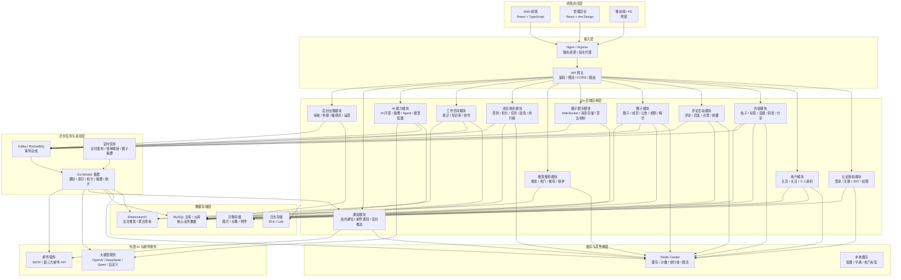
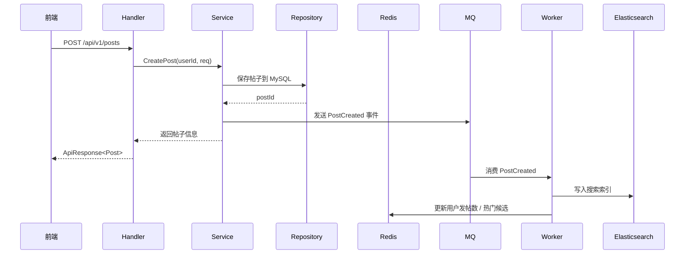
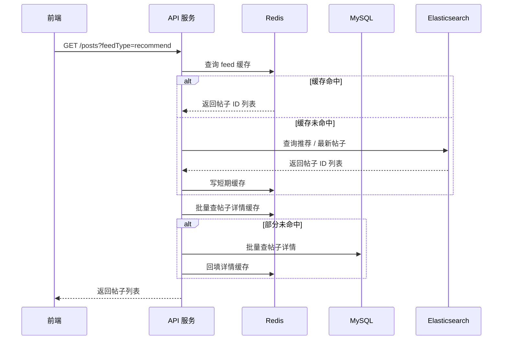
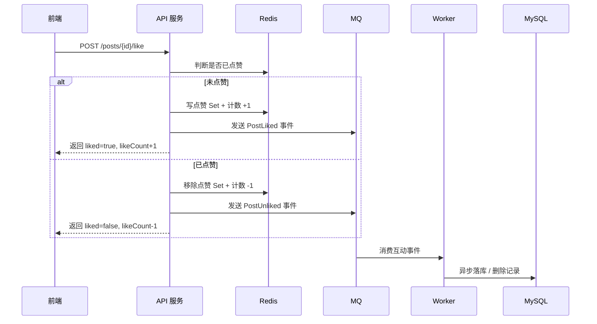
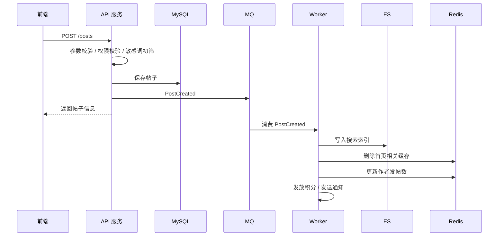
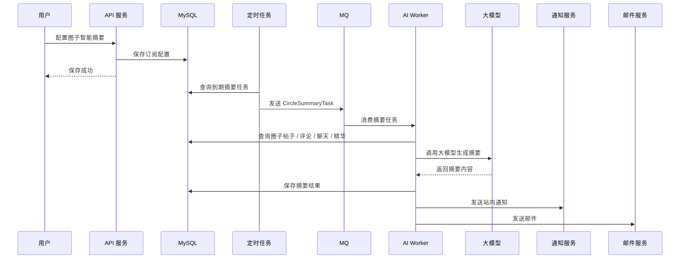

# 开发者知识社区 V2.1 后端整体技术方案

## 1. 建设目标

社区 V2.1 后端需要支撑以下核心能力：

```text
1. 内容社区：帖子、评论、点赞、收藏、转发、分享、标签、话题
2. 圈子社区：圈子、成员、聊天、公告、规则、精华、智能摘要
3. 搜索推荐：全文搜索、热门搜索、热门榜单、个性化推荐
4. 成长体系：签到、积分、等级、任务、勋章、排行榜
5. 工作空间：笔记、知识库、协作成员、AI 问答、模型配置
6. AI 能力：首页 AI 快问、笔记优化、话题 Agent、圈子智能摘要
7. 后台治理：用户、内容、审核、举报、敏感词、运营、AI 配置
8. 高并发支撑：缓存、消息队列、异步任务、搜索引擎、对象存储
9. 前后端分离：提供 REST API，支持 Web 前端独立部署
```

整体技术方向：

```text
Go 后端 + MySQL 主存储 + Redis 缓存 + Kafka/RocketMQ 消息队列
+ Elasticsearch 搜索 + 对象存储 + 定时任务 + WebSocket 推送
```

---

# 2. 推荐技术栈

## 2.1 后端语言与框架

| 类型        | 技术选型                                 | 说明                        |
| --------- | ------------------------------------ | ------------------------- |
| 后端语言      | Go                                   | 适合高并发、工程化、部署简单            |
| HTTP 框架   | Gin                       | Gin 简单成熟     |
| ORM       | GORM                        | GORM 开发快      |
| 配置管理      | Viper                                | 管理 yaml/env 配置            |
| 日志        | Zap                     | 高性能结构化日志                  |
| 参数校验      | validator                            | 请求参数校验                    |
| API 文档    | Swaggo                   | 自动生成 Swagger 文档           |
| 认证        | JWT                                  | 前后端分离常用                   |
| 权限        | Casbin                               | 后台权限、圈子权限、资源权限            |
| 定时任务      | robfig/cron   |robfig|
| WebSocket | Gorilla WebSocket / nhooyr/websocket | 圈子聊天、通知推送                 |
| 链路追踪      | OpenTelemetry                        | 后期接入可观测性                  |

---

## 2.2 存储与中间件

| 类型     | 技术选型                        | 使用场景                      |
| ------ | --------------------------- | ------------------------- |
| 关系型数据库 | MySQL                       | 用户、帖子、评论、圈子、权限、后台管理等核心数据  |
| 缓存     | Redis                       | 登录态、热点内容、计数、排行榜、限流、关注关系缓存 |
| 消息队列   | Kafka            | 异步通知、搜索索引、积分任务、AI 摘要、审核流水 |
| 搜索引擎   | Elasticsearch    | 帖子、评论、用户、圈子、话题、笔记搜索       |
| 对象存储   | MinIO / OSS       | 图片、头像、附件、活动封面、话题封面        |
| 定时任务   |   Cron     | 定时发布、圈子摘要、排行榜刷新、数据统计      |
| 监控     | Prometheus + Grafana        | QPS、延迟、错误率、资源监控           |
| 日志检索   | ELK                  | 应用日志、错误排查、操作审计            |
| 部署     | Docker Compose    | 个人项目可先 Compose，后期扩展 K8s   |

---

# 3. 整体架构框图



---

# 4. 推荐后端架构模式

## 4.1 阶段一：模块化单体，推荐起步

项目功能很多。建议采用 **模块化单体架构**：

```text
一个 Go 后端项目
一个统一 API 服务
内部按领域模块拆包
共用 MySQL、Redis、MQ、ES
```

优点：

```text
1. 开发效率高
2. 部署简单
3. 调试方便
4. 适合 MVP 和个人项目
5. 后期可以平滑拆成微服务
```

推荐目录：
Feedora-backend
├── cmd
│   ├── api
│   │   └── main.go                         # API 服务启动入口
│   │
│   ├── worker
│   │   └── main.go                         # Kafka Worker 启动入口
│   │
│   └── migrate
│       └── main.go                         # 数据库迁移 / 初始化入口，可选
│
├── configs
│   ├── config.yaml                         # 默认配置
│   ├── config.local.yaml                   # 本地开发配置
│   ├── config.dev.yaml                     # 测试环境配置
│   └── config.prod.yaml                    # 生产环境配置
│
├── internal
│   ├── app
│   │   ├── app.go                          # 应用初始化，组装 DB、Redis、Kafka、ES、OSS
│   │   └── wire.go                         # 依赖注入预留，可选
│   │
│   ├── router
│   │   ├── router.go                       # 总路由注册入口
│   │   ├── auth_router.go                  # 认证模块路由
│   │   ├── user_router.go                  # 用户模块路由
│   │   ├── post_router.go                  # 帖子模块路由
│   │   ├── comment_router.go               # 评论模块路由
│   │   ├── interaction_router.go           # 点赞收藏模块路由
│   │   ├── tag_router.go                   # 标签模块路由
│   │   ├── topic_router.go                 # 话题模块路由
│   │   ├── circle_router.go                # 圈子模块路由
│   │   ├── file_router.go                  # 文件上传模块路由
│   │   ├── search_router.go                # 搜索模块路由
│   │   ├── notification_router.go          # 通知模块路由
│   │   ├── rank_router.go                  # 榜单模块路由
│   │   └── admin_router.go                 # 后台管理路由
│   │
│   ├── api
│   │   ├── auth_api.go                     # 登录、注册、当前用户接口
│   │   ├── user_api.go                     # 用户资料、我的主页接口
│   │   ├── post_api.go                     # 帖子列表、详情、发布、编辑接口
│   │   ├── comment_api.go                  # 评论、回复接口
│   │   ├── interaction_api.go              # 点赞、收藏、分享接口
│   │   ├── tag_api.go                      # 标签接口
│   │   ├── topic_api.go                    # 话题接口
│   │   ├── circle_api.go                   # 圈子接口
│   │   ├── file_api.go                     # 文件上传接口
│   │   ├── search_api.go                   # 搜索接口
│   │   ├── notification_api.go             # 通知接口
│   │   ├── rank_api.go                     # 热门榜单、排行榜接口
│   │   └── admin_api.go                    # 后台管理接口
│   │
│   ├── dto
│   │   ├── common.go                       # 通用请求、分页请求、分页响应
│   │   ├── auth_dto.go                     # 认证请求 / 响应 DTO
│   │   ├── user_dto.go                     # 用户 DTO
│   │   ├── post_dto.go                     # 帖子 DTO
│   │   ├── comment_dto.go                  # 评论 DTO
│   │   ├── interaction_dto.go              # 点赞收藏 DTO
│   │   ├── tag_dto.go                      # 标签 DTO
│   │   ├── topic_dto.go                    # 话题 DTO
│   │   ├── circle_dto.go                   # 圈子 DTO
│   │   ├── file_dto.go                     # 文件上传 DTO
│   │   ├── search_dto.go                   # 搜索 DTO
│   │   ├── notification_dto.go             # 通知 DTO
│   │   ├── rank_dto.go                     # 榜单 DTO
│   │   └── admin_dto.go                    # 后台 DTO
│   │
│   ├── service
│   │   ├── auth_service.go                 # 认证业务逻辑
│   │   ├── user_service.go                 # 用户业务逻辑
│   │   ├── post_service.go                 # 帖子业务逻辑
│   │   ├── comment_service.go              # 评论业务逻辑
│   │   ├── interaction_service.go          # 点赞收藏业务逻辑
│   │   ├── tag_service.go                  # 标签业务逻辑
│   │   ├── topic_service.go                # 话题业务逻辑
│   │   ├── circle_service.go               # 圈子业务逻辑
│   │   ├── file_service.go                 # 文件上传业务逻辑
│   │   ├── search_service.go               # 搜索业务逻辑
│   │   ├── notification_service.go         # 通知业务逻辑
│   │   ├── rank_service.go                 # 榜单业务逻辑
│   │   └── admin_service.go                # 后台业务逻辑
│   │
│   ├── repository
│   │   ├── auth_repository.go              # 认证相关数据库查询
│   │   ├── user_repository.go              # 用户数据库查询
│   │   ├── post_repository.go              # 帖子数据库查询
│   │   ├── comment_repository.go           # 评论数据库查询
│   │   ├── interaction_repository.go       # 点赞收藏数据库查询
│   │   ├── tag_repository.go               # 标签数据库查询
│   │   ├── topic_repository.go             # 话题数据库查询
│   │   ├── circle_repository.go            # 圈子数据库查询
│   │   ├── file_repository.go              # 文件记录数据库查询
│   │   ├── notification_repository.go      # 通知数据库查询
│   │   ├── growth_repository.go            # 积分成长数据库查询
│   │   ├── outbox_repository.go            # Outbox 事件数据库查询
│   │   ├── admin_repository.go             # 后台数据库查询
│   │   └── tx.go                           # 事务封装
│   │
│   ├── model
│   │   ├── base.go                         # BaseModel、通用字段
│   │   ├── constants.go                    # 状态常量、角色常量
│   │   ├── user.go                         # 用户模型
│   │   ├── post.go                         # 帖子、帖子图片、帖子标签、帖子话题模型
│   │   ├── comment.go                      # 评论模型
│   │   ├── interaction.go                  # 点赞、收藏、分享、转发模型
│   │   ├── tag.go                          # 标签模型
│   │   ├── topic.go                        # 话题模型
│   │   ├── circle.go                       # 圈子、圈子成员、禁言模型
│   │   ├── file.go                         # 文件模型
│   │   ├── notification.go                 # 通知模型
│   │   ├── growth.go                       # 积分、等级、任务、勋章模型
│   │   ├── outbox.go                       # 事件 Outbox 模型
│   │   ├── worker.go                       # Worker 幂等消费记录模型
│   │   ├── admin.go                        # 后台操作日志模型
│   │   └── all.go                          # 模型统一注册 AutoMigrate
│   │
│   ├── cache
│   │   ├── keys.go                         # Redis Key 统一生成
│   │   ├── user_cache.go                   # 用户缓存
│   │   ├── post_cache.go                   # 帖子缓存
│   │   ├── circle_cache.go                 # 圈子缓存
│   │   ├── counter_cache.go                # 计数缓存
│   │   ├── rank_cache.go                   # 榜单 ZSet 缓存
│   │   ├── search_cache.go                 # 搜索热词、搜索结果缓存
│   │   ├── notification_cache.go           # 通知未读数缓存
│   │   └── idempotency_cache.go            # Worker 幂等缓存
│   │
│   ├── event
│   │   ├── event.go                        # 统一事件结构
│   │   ├── event_type.go                   # 事件类型常量
│   │   ├── topic.go                        # Kafka Topic 常量
│   │   ├── producer.go                     # Kafka Producer 封装
│   │   ├── outbox.go                       # 写 Outbox 事件封装
│   │   └── payload.go                      # 常用事件 Payload 定义
│   │
│   ├── worker
│   │   ├── worker.go                       # Worker 总启动入口
│   │   ├── dispatcher
│   │   │   └── outbox_dispatcher.go        # Outbox 可靠投递 Kafka
│   │   │
│   │   ├── consumer
│   │   │   ├── consumer.go                 # Kafka Consumer 通用封装
│   │   │   └── handler.go                  # Consumer Handler 接口定义
│   │   │
│   │   ├── search
│   │   │   └── search_worker.go            # 同步 ES 索引
│   │   │
│   │   ├── notification
│   │   │   └── notification_worker.go      # 生成站内通知
│   │   │
│   │   ├── growth
│   │   │   └── growth_worker.go            # 发放积分、更新成长数据
│   │   │
│   │   ├── rank
│   │   │   └── rank_worker.go              # 更新热门榜单、排行榜
│   │   │
│   │   ├── stat
│   │   │   └── stat_worker.go              # 统计数据处理
│   │   │
│   │   └── counter
│   │       └── counter_flush_worker.go     # Redis 计数回写 MySQL
│   │
│   ├── search
│   │   ├── client.go                       # ES Client 初始化
│   │   ├── index.go                        # 索引初始化
│   │   ├── post_index.go                   # 帖子索引结构和写入
│   │   ├── user_index.go                   # 用户索引结构和写入
│   │   ├── circle_index.go                 # 圈子索引结构和写入
│   │   ├── topic_index.go                  # 话题索引结构和写入
│   │   └── query.go                        # ES 查询封装
│   │
│   └── domain
│       ├── auth.go                         # 领域对象，可选
│       ├── user.go
│       ├── post.go
│       ├── circle.go
│       └── search.go
│
├── pkg
│   ├── config
│   │   └── config.go                       # 配置加载
│   │
│   ├── database
│   │   └── mysql.go                        # MySQL / GORM 初始化
│   │
│   ├── redisx
│   │   └── redis.go                        # Redis 初始化
│   │
│   ├── kafkax
│   │   ├── producer.go                     # Kafka Producer 基础封装
│   │   └── consumer.go                     # Kafka Consumer 基础封装
│   │
│   ├── esx
│   │   └── elasticsearch.go                # ES 初始化
│   │
│   ├── ossx
│   │   ├── storage.go                      # OSS 抽象接口
│   │   ├── minio.go                        # MinIO 实现
│   │   └── aliyun.go                       # 阿里云 OSS 实现，预留
│   │
│   ├── jwtx
│   │   └── jwt.go                          # JWT 生成和解析
│   │
│   ├── middleware
│   │   ├── auth.go                         # 登录鉴权中间件
│   │   ├── admin.go                        # 管理员权限中间件
│   │   ├── cors.go                         # 跨域中间件
│   │   ├── logger.go                       # 请求日志中间件
│   │   ├── recover.go                      # panic 恢复中间件
│   │   ├── trace.go                        # traceId 中间件
│   │   └── rate_limit.go                   # 限流中间件
│   │
│   ├── response
│   │   └── response.go                     # 统一响应封装
│   │
│   ├── errors
│   │   ├── code.go                         # 错误码
│   │   └── error.go                        # 业务错误结构
│   │
│   ├── logger
│   │   └── logger.go                       # Zap 日志封装
│   │
│   ├── validator
│   │   └── validator.go                    # 参数校验封装
│   │
│   ├── utils
│   │   ├── password.go                     # 密码加密校验
│   │   ├── id.go                           # ID / UUID 生成
│   │   ├── time.go                         # 时间工具
│   │   ├── hash.go                         # queryHash 等工具
│   │   └── file.go                         # 文件类型判断
│   │
│   └── singleflightx
│       └── singleflight.go                 # 防缓存击穿封装
│
├── docs
│   ├── docs.go                             # swag init 生成
│   ├── swagger.json                        # swag init 生成
│   ├── swagger.yaml                        # swag init 生成
│   ├── api.md                              # 接口说明
│   ├── database.md                         # 数据库设计
│   ├── redis-key-design.md                 # Redis Key 设计
│   ├── kafka-topic-design.md               # Kafka Topic 设计
│   ├── es-index-design.md                  # ES 索引设计
│   ├── worker-design.md                    # Worker 设计
│   ├── deployment.md                       # 部署说明
│   └── layered-refactor.md                 # 分层结构说明
│
├── migrations
│   ├── 001_init_users.sql
│   ├── 002_init_posts.sql
│   ├── 003_init_comments.sql
│   ├── 004_init_circles.sql
│   ├── 005_init_admin.sql
│   ├── 006_stage2_outbox.sql
│   ├── 007_notifications.sql
│   ├── 008_growth.sql
│   ├── 009_worker_idempotency.sql
│   └── 010_indexes.sql
│
├── deployments
│   ├── docker-compose.yml
│   ├── Dockerfile.api
│   ├── Dockerfile.worker
│   ├── nginx.conf
│   ├── mysql
│   │   └── init.sql
│   ├── redis
│   │   └── redis.conf
│   └── elasticsearch
│       └── index-init.sh
│
├── scripts
│   ├── swag.sh                             # 生成 Swagger 文档
│   ├── migrate.sh                          # 执行数据库迁移
│   ├── seed.sh                             # 初始化种子数据
│   ├── run-api.sh                          # 本地启动 API
│   ├── run-worker.sh                       # 本地启动 Worker
│   └── docker-up.sh                        # Docker Compose 启动
│
│
├── .env.example
├── .gitignore
├── go.mod
├── go.sum
├── Makefile
└── README.md
---

# 5. 分层架构设计

```text
CMD层：启动API的main.go、定时任务main.go等
API层：HTTP 参数解析、登录态读取、响应封装
Service 层：根据模块细分文件，处理业务逻辑、事务编排、权限判断
Repository 层：数据模型相关：封装数据模型，sql
Cache 层：Redis 缓存读写
Event 层：发送领域事件到 MQ
Touter 层：封装路由等
pkg包 ：封装配置、数据库连接、es、redis连接、日志、工具等等
部署相关包：
```

典型调用链：



---

# 6. 核心模块划分

## 6.1 用户与认证模块

负责：

```text
注册
登录
JWT
用户资料
用户主页
关注关系
用户状态
用户权限
```

核心数据：

```text
users
user_profiles
user_follows
user_blocks
user_sessions
```

缓存建议：

```text
user:profile:{userId}
user:followings:{userId}
user:followers:{userId}
auth:token:{tokenId}
```

高并发注意：

```text
1. 用户资料读多写少，适合 Redis 缓存。
2. 关注关系可以用 Redis Set 缓存。
3. JWT 校验本地完成，减少数据库访问。
4. 封禁、禁言状态需要缓存，但后台修改后要主动删除缓存。
```

---

## 6.2 内容帖子模块

负责：

```text
发帖
编辑帖子
删除帖子
隐藏帖子
草稿
审核中
定时发布
标签
话题
圈子可见范围
转发
分享
```

核心数据：

```text
posts
post_contents
post_tags
post_topics
post_reposts
post_visibility
post_audit_records
scheduled_posts
```

缓存建议：

```text
post:detail:{postId}
post:list:home:{queryHash}
post:list:user:{userId}
post:hot:{timeRange}
post:counter:{postId}
```

高并发注意：

```text
1. 帖子详情缓存。
2. 首页列表只缓存短时间，例如 30 秒到 2 分钟。
3. 点赞数、评论数、收藏数、分享数放 Redis 计数。
4. 计数异步回写 MySQL。
5. 发帖后通过 MQ 异步写 ES。
6. 隐藏、删除、下架帖子时，要删除缓存并同步 ES 状态。
```

---

## 6.3 评论模块

负责：

```text
一级评论
二级回复
评论点赞
评论删除
评论审核
评论定位
```

核心数据：

```text
comments
comment_likes
comment_audit_records
```

缓存建议：

```text
post:comments:{postId}:page:{cursor}
comment:reply:{commentId}
comment:counter:{commentId}
```

高并发注意：

```text
1. 评论采用游标分页，避免深分页。
2. 热门帖子评论可以缓存第一页。
3. 评论写入后异步更新帖子评论数。
4. 评论通知异步发送。
5. 评论内容异步进入审核 / 敏感词检测。
```

---

## 6.4 互动模块

负责：

```text
帖子点赞
帖子收藏
评论点赞
分享
转发
```

核心数据：

```text
post_likes
post_favorites
comment_likes
post_shares
post_reposts
```

Redis 设计：

```text
post:liked:{postId}              Set，点赞用户集合
user:liked_posts:{userId}        Set，用户点赞帖子
post:favorited:{postId}          Set，收藏用户集合
user:favorites:{userId}          Set，用户收藏帖子
post:counter:{postId}            Hash，like/comment/favorite/share/repost
```

高并发注意：

```text
1. 点赞收藏先写 Redis。
2. 通过 MQ 异步落库。
3. 需要保证幂等，重复点赞不能重复加数。
4. Redis 写成功后立即返回，提升体验。
5. Worker 批量同步 MySQL。
```

---

## 6.5 圈子模块

负责：

```text
圈子列表
创建圈子
加入圈子
申请加入
退出圈子
圈子首页
圈子公告
圈子规则
圈子精华
圈子置顶
圈子成员管理
禁言 / 解禁
踢人
```

核心数据：

```text
circles
circle_members
circle_join_requests
circle_announcements
circle_rules
circle_featured_posts
circle_top_posts
circle_mute_records
```

缓存建议：

```text
circle:detail:{circleId}
circle:members:{circleId}
circle:member:{circleId}:{userId}
circle:hot:list
circle:created:{userId}
circle:joined:{userId}
```

高并发注意：

```text
1. 圈子详情缓存。
2. 圈子成员关系缓存，用于判断是否能发帖、聊天。
3. 成员数、帖子数用 Redis 计数。
4. 禁言状态必须缓存，提高发帖和聊天校验效率。
5. 圈子列表按推荐、热门、我加入、我创建分别缓存。
```

---

## 6.6 圈子聊天模块

负责：

```text
圈子聊天消息
WebSocket 连接
消息发送
消息列表
禁言判断
系统消息
实时推送
```

核心数据：

```text
circle_chat_messages
circle_chat_connections，可不入库
circle_chat_read_states
```

推荐架构：

```text
前端 WebSocket
        ↓
Chat Gateway
        ↓
Redis Pub/Sub 或 MQ
        ↓
多个 Chat 节点广播
        ↓
在线用户收到消息
```

高并发注意：

```text
1. Chat 服务建议独立部署。
2. 消息写 MySQL 或 MongoDB，MVP 可以先 MySQL。
3. 最近消息缓存到 Redis List。
4. WebSocket 节点多实例时，用 Redis Pub/Sub 同步广播。
5. 圈子禁言状态走 Redis。
6. 大圈子不要全量推送给所有用户，先做在线连接推送。
```

---

## 6.7 搜索模块

负责：

```text
全局搜索
帖子搜索
评论搜索
用户搜索
圈子搜索
话题搜索
标签搜索
搜索联想
热门搜索
```

使用：

```text
Elasticsearch / OpenSearch
```

索引建议：

```text
community_posts
community_comments
community_users
community_circles
community_topics
community_notes，可选
```

写入方式：

```text
业务写 MySQL
      ↓
发送 MQ 事件
      ↓
Search Worker 消费
      ↓
写入 ES 索引
```

高并发注意：

```text
1. 不要在发帖接口同步写 ES。
2. 通过 MQ 异步索引。
3. 搜索结果可以短期缓存。
4. 热门搜索词用 Redis Sorted Set。
5. ES 索引需要保存内容状态，隐藏、删除、下架不可被搜索。
```

---

## 6.8 推荐与热门榜单模块

负责：

```text
首页推荐
热门帖子
热门圈子
热门话题
关注流
相似内容推荐
冷启动推荐
排行榜
```

Redis 设计：

```text
rank:post:today
rank:post:week
rank:post:all
rank:circle:today
rank:topic:today
rank:user:active:day
rank:user:creator:week
```

热门分计算：

```text
热度 = 点赞数 * 3
     + 评论数 * 5
     + 收藏数 * 4
     + 分享数 * 3
     + 转发数 * 4
     + 浏览数 * 1
     - 时间衰减
```

实现建议：

```text
1. 行为事件进入 MQ。
2. Worker 实时更新 Redis ZSet 分数。
3. 定时任务周期性重新计算榜单。
4. 查询榜单优先读 Redis。
5. Redis 中只存 ID 和分数，详情批量查缓存 / MySQL。
```

---

## 6.9 成长体系模块

负责：

```text
签到
积分
经验
等级
任务
勋章
排行榜
创作者中心
```

核心数据：

```text
user_points
user_point_logs
level_rules
badges
user_badges
tasks
user_tasks
checkins
creator_stats
```

缓存建议：

```text
user:growth:{userId}
user:checkin:{userId}:{date}
rank:user:active:{range}
rank:user:creator:{range}
```

高并发注意：

```text
1. 签到需要幂等，防止重复签到。
2. 积分变更必须写流水。
3. 积分可以通过 MQ 异步发放，但用户关键操作可同步返回结果。
4. 排行榜用 Redis ZSet。
5. 任务完成状态可异步计算。
```

---

## 6.10 工作空间模块

负责：

```text
笔记
Markdown 内容
知识库
知识库成员
邀请好友
笔记发布成帖子
AI 回答保存为笔记
```

核心数据：

```text
workspace_notes
knowledge_bases
knowledge_base_members
knowledge_base_invites
note_versions，可选
```

搜索建议：

```text
笔记可以后期写入 ES，支持知识库全文搜索。
```

Markdown 处理：

```text
后端保存 Markdown 原文 content_md。
前端负责渲染 Markdown。
后端可以生成 summary 字段用于列表展示。
```

缓存建议：

```text
workspace:note:{noteId}
workspace:kbs:{userId}
workspace:kb:members:{kbId}
```

高并发注意：

```text
1. 工作空间偏私域，读写压力低于首页。
2. 可优先 MySQL。
3. 笔记详情可缓存。
4. 知识库成员权限需要缓存。
```

---

## 6.11 AI 模块

负责：

```text
首页 AI 快问
工作空间 AI 问答
AI 回答编辑
AI 回答保存到笔记
AI 回答发布成帖子
笔记 AI 优化
话题 AI Agent
圈子智能摘要
用户模型配置
后台基础模型配置
Token 配额管理
```

核心数据：

```text
ai_model_configs
user_model_configs
ai_chat_sessions
ai_chat_messages
ai_call_logs
ai_token_usages
circle_summary_subscriptions
circle_ai_summaries
```

AI 调用方式：

```text
前端请求后端 AI API
        ↓
后端校验用户模型配置 / Token 配额
        ↓
后端调用大模型供应商
        ↓
保存调用日志
        ↓
返回结果
```

高并发注意：

```text
1. AI 调用不能无限制，需要 Token 配额。
2. 圈子摘要走异步任务，不要阻塞用户请求。
3. AI 调用日志必须记录输入 token、输出 token、模型、场景、耗时。
4. 可用 MQ 做 AI 任务队列。
5. 长文本总结可以异步执行，完成后通知用户。
```

---

## 6.12 通知模块

负责：

```text
点赞通知
评论通知
回复通知
关注通知
审核通知
圈子通知
成长通知
活动通知
系统通知
邮箱通知
WebSocket 实时推送
```

核心数据：

```text
notifications
notification_reads
email_tasks
```

通知流程：

```text
业务事件
  ↓
MQ
  ↓
Notification Worker
  ↓
写 notifications 表
  ↓
在线用户 WebSocket 推送
  ↓
需要邮件时发送邮件
```

高并发注意：

```text
1. 通知必须异步。
2. 批量事件可以合并通知，例如“10 人点赞了你的帖子”。
3. 未读数缓存 Redis。
4. 用户查看通知后更新已读状态。
```

---

## 6.13 后台治理模块

负责：

```text
用户管理
帖子管理
评论管理
审核管理
举报管理
标签管理
圈子管理
话题管理
搜索管理
推荐管理
积分等级管理
勋章管理
任务管理
活动管理
推荐位管理
官方公告管理
敏感词管理
操作日志
AI 模型管理
Token 配置
```

核心关注：

```text
1. 权限控制
2. 操作审计
3. 内容审核
4. 运营配置
5. 数据统计
```

建议：

```text
后台所有写操作都写 operation_logs。
管理员权限用 RBAC + Casbin。
敏感词管理放 Redis / 本地缓存。
```

---

# 7. 高并发核心设计

## 7.1 读多写少场景

典型场景：

```text
首页帖子流
帖子详情
圈子详情
话题详情
热门榜单
排行榜
用户主页
```

处理方式：

```text
1. Redis 缓存热点详情。
2. 首页和榜单短 TTL 缓存。
3. MySQL 主从读写分离。
4. 热门内容预热缓存。
5. ES 负责搜索和聚合，不压 MySQL。
```

---

## 7.2 高频写场景

典型场景：

```text
点赞
收藏
评论
分享
浏览
签到
聊天消息
通知
```

处理方式：

```text
1. Redis 承接高频计数。
2. MQ 异步落库。
3. Worker 批量写 MySQL。
4. 关键操作保证幂等。
5. 热点 Key 分片，防止 Redis 热 Key。
```

---

## 7.3 热点 Key 处理

例如：

```text
post:counter:{postId}
rank:post:today
circle:chat:{circleId}
```

优化方式：

```text
1. 本地缓存 + Redis 缓存。
2. 热点计数分片：post:counter:{postId}:{shard}
3. 定时聚合分片结果。
4. 热门列表只缓存 ID，详情批量取。
5. 使用 singleflight 防止缓存击穿。
```

Go 可用：

```text
golang.org/x/sync/singleflight
```

---

## 7.4 缓存一致性

推荐策略：

```text
1. 读：先 Redis，未命中查 MySQL，再写 Redis。
2. 写：先写 MySQL，再删除 Redis。
3. 高频计数：先写 Redis，异步刷 MySQL。
4. 搜索索引：MySQL 成功后发 MQ，异步写 ES。
```

不要强求所有场景实时一致。社区类产品大多数地方允许最终一致。

---

# 8. 消息队列事件设计

建议所有异步动作都抽象成事件。

## 8.1 核心 Topic

```text
community.post.events
community.comment.events
community.interaction.events
community.circle.events
community.chat.events
community.notification.events
community.search.index.events
community.growth.events
community.ai.events
community.audit.events
community.stat.events
```

---

## 8.2 事件示例

### 帖子创建事件

```json
{
  "eventId": "evt_001",
  "eventType": "PostCreated",
  "postId": 10001,
  "userId": 20001,
  "createdAt": "2026-07-05T10:00:00+08:00"
}
```

消费方：

```text
1. Search Worker：写 ES
2. Growth Worker：发放发帖积分
3. Notification Worker：通知关注者
4. Stat Worker：更新统计
5. Recommend Worker：更新推荐候选池
```

---

### 点赞事件

```json
{
  "eventId": "evt_002",
  "eventType": "PostLiked",
  "postId": 10001,
  "fromUserId": 20001,
  "toUserId": 30001,
  "createdAt": "2026-07-05T10:00:00+08:00"
}
```

消费方：

```text
1. Notification Worker：点赞通知
2. Growth Worker：作者获得积分
3. Rank Worker：更新热门分
4. Stat Worker：更新统计
```

---

# 9. Elasticsearch 索引设计

## 9.1 帖子索引

```json
{
  "postId": 10001,
  "title": "Go 项目部署复盘",
  "content": "Markdown 原文或纯文本摘要",
  "summary": "摘要",
  "authorId": 20001,
  "authorName": "张三",
  "tagIds": [1, 2],
  "tagNames": ["Go语言", "项目实战"],
  "topicIds": [1],
  "topicNames": ["个人项目部署"],
  "circleId": 1,
  "circleName": "Go 后端开发圈",
  "visibility": "public",
  "status": "published",
  "likeCount": 100,
  "commentCount": 20,
  "favoriteCount": 30,
  "hotScore": 1200,
  "createdAt": "2026-07-05T10:00:00+08:00"
}
```

查询时必须过滤：

```text
status = published
visibility = public 或当前用户有权限查看
```

---

## 9.2 搜索同步策略

```text
新增帖子 -> PostCreated -> 写 ES
编辑帖子 -> PostUpdated -> 更新 ES
隐藏帖子 -> PostHidden -> ES 状态改 hidden 或删除文档
删除帖子 -> PostDeleted -> 删除 ES 文档
下架帖子 -> PostTakedown -> ES 状态改 takedown
```

---

# 10. Redis Key 初步设计

```text
# 用户
user:profile:{userId}
user:followings:{userId}
user:followers:{userId}

# 帖子
post:detail:{postId}
post:counter:{postId}
post:liked:{postId}
post:favorited:{postId}
user:liked_posts:{userId}
user:favorites:{userId}

# 首页列表
feed:home:{queryHash}
feed:following:{userId}:{cursor}

# 圈子
circle:detail:{circleId}
circle:member:{circleId}:{userId}
circle:members:{circleId}
circle:joined:{userId}
circle:created:{userId}

# 聊天
circle:chat:recent:{circleId}

# 热门榜单
rank:post:today
rank:post:week
rank:post:all
rank:circle:today
rank:topic:today

# 成长体系
user:growth:{userId}
user:checkin:{userId}:{date}
rank:user:active:day
rank:user:creator:week

# 通知
notify:unread:{userId}

# 限流
rate:api:{userId}:{api}
rate:ip:{ip}

# AI
ai:token:usage:{userId}:{date}
ai:model:config:{userId}

# 敏感词
sensitive:words
```

---

# 11. 核心请求链路设计

## 11.1 首页内容流



---

## 11.2 点赞链路



---

## 11.3 发帖链路



---

## 11.4 圈子智能摘要链路



---

# 12. 数据库设计原则

## 12.1 MySQL 分库分表预留

前期可以单库多表。

后期高并发场景可拆：

```text
user_db
content_db
circle_db
interaction_db
workspace_db
admin_db
```

热点表可分表：

```text
posts
comments
post_likes
post_favorites
notifications
circle_chat_messages
```

分表键建议：

```text
user_id
post_id
circle_id
created_at
```

---

## 12.2 数据状态设计

所有核心业务表建议有状态字段：

```text
status
created_at
updated_at
deleted_at
```

内容类数据建议软删除：

```text
deleted_at IS NOT NULL
```

好处：

```text
1. 支持审计
2. 支持恢复
3. 防止误删
4. 便于后台治理
```

---

# 13. 权限与安全设计

## 13.1 用户权限

```text
游客
普通用户
创作者
圈主
圈子管理员
后台管理员
系统管理员
```

---

## 13.2 权限校验场景

```text
1. 未登录不能点赞、评论、收藏、发帖。
2. 被禁言用户不能发帖、评论、聊天。
3. 非圈子成员不能在私有圈子发帖。
4. 圈子内禁言用户不能在圈子发帖或聊天。
5. 管理员操作需要后台权限。
6. 用户只能编辑、隐藏、删除自己的帖子。
7. 帖子作者可以删除自己帖子下的评论。
```

---

## 13.3 安全措施

```text
JWT 鉴权
RBAC 权限
Casbin 资源权限
接口限流
IP 限流
敏感词过滤
内容审核
XSS 防护
上传文件类型校验
图片大小限制
后台操作日志
AI Token 限额
```

---

# 14. 部署架构建议

## 14.1 MVP 部署

适合个人项目：

```text
1 台云服务器
Docker Compose 部署：

frontend
backend-api
backend-worker
backend-scheduler
mysql
redis
elasticsearch
kafka 或 rocketmq
minio
nginx
prometheus
grafana
```

---

## 14.2 中等规模部署

```text
Nginx / API Gateway
多实例 Go API
独立 Worker 集群
独立 WebSocket Chat 服务
MySQL 主从
Redis Cluster
ES 集群
MQ 集群
对象存储使用云 OSS
Prometheus + Grafana
ELK / Loki
```

---

# 15. 推荐落地阶段

## 阶段一：后端 MVP

先实现：

```text
1. 用户登录注册
2. 用户资料
3. 帖子发布 / 列表 / 详情
4. 评论
5. 点赞收藏
6. 标签话题
7. 圈子基础能力
8. 文件上传
9. Mock 前端切 Real API
```

---

## 阶段二：高并发基础

增加：

```text
1. Redis 缓存
2. Redis 计数
3. MQ 事件
4. ES 搜索
5. 通知异步化
6. 热门榜单
7. 排行榜
8. 定时发布
```

---

## 阶段三：V2.1 完整能力

增加：

```text
1. 工作空间
2. 知识库
3. AI 问答
4. 笔记 AI 优化
5. 话题 Agent
6. 圈子智能摘要
7. 后台 AI 配置
8. Token 配额
```

---

## 阶段四：平台化与治理

增加：

```text
1. 推荐系统增强
2. 用户画像
3. 内容质量评分
4. 精细化权限
5. 完整运营数据看板
6. 审核策略平台
7. 多实例部署
8. 链路追踪和压测
```

---

# 16. 最终技术方案总结

这个社区后端可以按下面的思路落地：

```text
1. Go 做统一 API 服务，先采用模块化单体。
2. MySQL 保存核心业务数据。
3. Redis 承接热点缓存、计数、排行榜、限流、关注关系。
4. Kafka / RocketMQ 做异步事件总线。
5. Elasticsearch 做全文搜索、搜索联想和聚合查询。
6. MinIO / OSS 保存图片、头像和附件。
7. Worker 负责通知、搜索索引、积分、榜单、AI 摘要等异步任务。
8. WebSocket 服务负责圈子聊天和实时通知。
9. AI 模块通过模型适配层对接 OpenAI、DeepSeek、Qwen 或自定义模型。
10. 后台通过 RBAC + Casbin 管理权限，并记录操作日志。
```

一句话总结：

```text
这是一个以 Go 为核心、MySQL 为主存储、Redis 承接高频访问、
MQ 解耦异步任务、Elasticsearch 支撑搜索推荐、
AI Worker 承载智能能力的开发者知识社区后端平台。
```
